# Dossier Technique & Manuel Utilisateur
## Projet DevOps - Application EtudLife
**Verson :** v0.3.0

**Auteurs :**
* Lyna Baouche
* Alicya-Pearl Marras
* Kenza Menad
* Dyhia Sellah

**Date :** 1er Janvier 2026

---

## 1. Présentation Générale

### 1.1 Objectif du Projet
Le projet **EtudLife** a pour vocation de centraliser les outils essentiels à la vie universitaire des étudiants de Nanterre. L'application vise à regrouper au sein d'une même interface les aspects sociaux, organisationnels et budgétaires de la vie étudiante.

### 1.2 Équipe & Contributeurs

| Membre | Rôle                                | GitHub                          |
| :--- |:------------------------------------|:--------------------------------|
| **Lyna Baouche** | Développeuse Fullstack / DevOps     | https://github.com/LynaBaouche  |
| **Alicya-Pearl Marras** | Développeuse Fullstack / DevOps     | https://github.com/alicyap      |
| **Kenza Menad** | Développeuse Fullstack / DevOps     | https://github.com/kenza-menad  |
| **Dyhia Sellah** | Développeuse Fullstack / DevOps     | https://github.com/DyhiaSellah1 |

### 1.3 Gestion de Projet & DevOps

Nous avons adopté une méthodologie inspirée des méthodes **Agile/Scrum**, adaptée à notre contexte universitaire et aux contraintes du projet.

* **Pilotage Agile (Lead : Lyna Baouche) :**
    * Organisation et pilotage des réunions de chaque sprint.
    * **Weekly Stand-up :** Remplacement du "Daily" par un point hebdomadaire pour synchroniser l'équipe.
    * **Sprints :** Cycles de développement courts ponctués par des releases.

* **Outils de Gestion :**
    * **Jira :** Suivi des tickets fonctionnels (Stories).
    * **Trello :** Gestion du Backlog technique.
    * **GitHub :** Gestion de version.

* **Pipeline CI/CD & Automatisation (Implémentation : Lyna Baouche) :**
  L'intégration et le déploiement sont automatisés via **GitHub Actions**.
    * **Gestion des Releases :** Création automatique des tags et des releases GitHub.
    * **Documentation :** Génération automatique des assets de release pour la documentation.
    * **UML :** Mise à jour automatique du diagramme de classe PlantUML à chaque push sur la branche principale via un workflow dédié (`update-uml.yml`).

---

## 2. Analyse Concurrentielle & UX

### 2.1 Étude de la concurrence
Comparaison effectuée avec les ENT classiques (Moodle) et les applications de BDE existantes.

### 2.2 Utilisabilité & Design
* **Interface :** Design System cohérent avec une palette dominante bleue.
* **Accessibilité :** Navigation simplifiée et responsive.
* **Architecture :** Simulation d'une Single Page Application (SPA).

---

## 3. Architecture Technique

### 3.1 Stack Technologique

L'application repose sur une architecture **REST API** robuste développée avec l'écosystème Spring.

**Backend :**
* **Langage :** Java 17 / 21.
* **Framework :** Spring Boot 3.
* **Architecture :** Modèle MVC / REST (Controller, Service, Repository).
* **ORM :** Hibernate (via Spring Data JPA).
* **API :** Architecture RESTful (Controller, Service, Repository).

**Base de Données :**
* **SGBD :** MySQL.
* **Hébergement :** AlwaysData (Cloud).

**Frontend :**
* **Technologies :** HTML5, CSS3, JavaScript (Vanilla).
* **Build Environment :** Gradle.

**Qualité & Tests :**
* **API Testing :** Une collection **Postman** complète a été intégrée pour valider les endpoints de l'API REST et assurer la non-régression.

### 3.2 Modélisation (UML) & Structure des Données

La modélisation s'articule autour de l'entité centrale **`Compte`**, qui représente l'étudiant et interagit avec les différents modules de l'application.

#### 1. Cœur du système : Utilisateur (`Compte`)
L'entité `Compte` centralise les informations personnelles (Email, Bio, Hobbies) et sert de pivot pour toutes les relations :
* **Authentification :** Stocke l'email (identifiant unique) et le mot de passe hashé.
* **Hobbies :** Une collection simple (`ElementCollection`) stocke les centres d'intérêt (ex: "Musique", "Sport") utilisés par l'algorithme de recommandation.

#### 2. Module Communautaire (`Groupe` & `Post`)
Ce module gère les interactions de groupe.
* **Relation `Compte` - `Groupe` (Many-to-Many) :** Un étudiant peut rejoindre plusieurs groupes, et un groupe contient plusieurs membres. Cette relation est gérée par la table de jointure `groupe_membres`.
* **Entité `Post` :** Représente une publication. Elle fait le lien (Many-to-One) entre :
    * Un **Auteur** (`Compte`) : Qui a écrit le message.
    * Un **Groupe** (`Groupe`) : Où le message est publié.

#### 3. Module Réseau Social (`Lien`)
Le système de "Proches" n'est pas une simple liste, mais une entité dédiée pour permettre plus de flexibilité.
* **Entité `Lien` :** Elle matérialise une relation orientée entre deux comptes :
    * `compteSource` : Celui qui ajoute.
    * `compteCible` : Celui qui est ajouté.
* Cette structure permet de gérer la date de création du lien (`dateCreation`) et facilite les requêtes asymétriques.

#### 4. Module Organisation & Vie Quotidienne
* **Agenda (`Evenement`) :**
    * Relation **One-to-Many** avec `Compte`. Chaque événement (Titre, Date début/fin, Couleur) appartient à un utilisateur spécifique.
    * Les événements des "Proches" sont récupérés via des requêtes croisées, sans lien direct en base de données.
* **Cuisine (`Recette`) :**
    * Les recettes sont des entités indépendantes (catalogue global).
    * Relation **Many-to-Many** (`favoris_recettes`) : Permet aux utilisateurs de se constituer une liste de recettes favorites personnelles.
* **Annonces :**
- Les annonces sont des entités créées par les utilisateurs afin de favoriser l’entraide étudiante.
- Relation **One-to-Many** avec `Compte` via l’identifiant de l’utilisateur (`utilisateur_id`).
- Chaque annonce contient des informations détaillées (titre, description, prix, catégorie, image, localisation, date de publication).
- Les utilisateurs peuvent :
    - créer,
    - modifier,
    - supprimer leurs propres annonces.
- Un système de **favoris d’annonces** permet de sauvegarder des annonces d’intérêt personnel.
- La publication d’une annonce déclenche une notification automatique vers les proches de l’auteur.
* **Document :**
* **Messagerie :**
#### 5. Système de Notification
* **Entité `Notification` :** Liée à un `Compte` (le destinataire), elle stocke le type d'action (`FRIEND_ADDED`, `NEW_EVENT`, `ANNONCE`, `NEW_MESSAGE`), le message et un lien de redirection, permettant une interaction asynchrone entre les utilisateurs.
### Diagramme de Classes Complet
Le diagramme de classe étant complexe, nous recommandons de l'ouvrir dans un nouvel onglet :
🔗 **[Voir le Diagramme de Classes Complet (Zoomable)](uml/diagram-zoomable.svg)**

---

## 4. Fonctionnalités Détaillées (User Guide)
### 4.1 Authentification & Sécurité

L’authentification est un pré-requis indispensable pour accéder à la plateforme **EtudLife**.  
Sans compte utilisateur valide et sans session active, l’accès aux fonctionnalités principales
(messagerie, annonces, agenda, documents, groupes) est strictement restreint.

#### Règles Métiers :
    * Accès restreint : seuls les utilisateurs authentifiés peuvent accéder à la plateforme.
    * Email universitaire obligatoire : l’inscription est autorisée uniquement avec une adresse se terminant par `@parisnanterre.fr`.
    * Email unique : une adresse email ne peut être associée qu’à un seul compte.
    * Mot de passe sécurisé: le mot de passe doit contenir des caractères autres que des lettres (chiffres et/ou caractères spéciaux).
    * Validation serveur : toutes les règles de sécurité sont appliquées côté backend.
    * Sécurité des mots de passe : aucun mot de passe n’est stocké en clair.
    * Traçabilité de connexion : la dernière activité de l’utilisateur est enregistrée.


#### Fonctionnalités :

##### Inscription
- Création de compte via une adresse email valide.
- Vérification des champs obligatoires (nom, prénom, email, mot de passe).
- Contrôle de l’unicité de l’adresse email via le `CompteRepository`.
- Hashage sécurisé du mot de passe avant enregistrement en base de données.

##### Connexion
- Authentification par email et mot de passe.
- Vérification sécurisée des identifiants côté backend.
- Mise à jour de la date de dernière connexion (`lastConnection`).
- Retour des informations utilisateur après authentification réussie.

##### Gestion du profil utilisateur
- Chaque utilisateur dispose d’une page **Profil** accessible après authentification.
- L’utilisateur peut modifier ses informations personnelles, notamment :numéro de téléphone, adresse, biographie...
- Les modifications sont effectuées via l’option **« Modifier le profil »**.
- Les données mises à jour sont immédiatement persistées en base de données.


#### Classes Impliquées :

    *`CompteController` (exposition des endpoints REST)
    * `CompteService` (logique métier d’authentification)
    * `CompteRepository` (accès aux données utilisateurs)
    * `Compte` (entité utilisateur)
    * `BCryptPasswordEncoder` (hashage des mots de passe)


#### Algorithme & Logique Backend :

- Lors de l’inscription, la méthode creerCompte du CompteService vérifie d’abord l’existence préalable d’un compte à partir de l’adresse email via findByEmail dans le CompteRepository. Si l’email est déjà présent en base de données, la création est refusée afin de garantir l’unicité des comptes. En cas de validation, le mot de passe fourni est automatiquement hashé à l’aide de BCryptPasswordEncoder avant la persistance de l’entité Compte, assurant une protection efficace des données sensibles.
- Lors de la connexion, la méthode login récupère le compte associé à l’email fourni. Le mot de passe saisi est comparé au hash stocké en base grâce à la méthode matches de BCrypt, sans jamais manipuler le mot de passe en clair. En cas d’authentification réussie, la date de dernière connexion (lastConnection) est mise à jour afin de permettre la gestion du statut en ligne de l’utilisateur.
  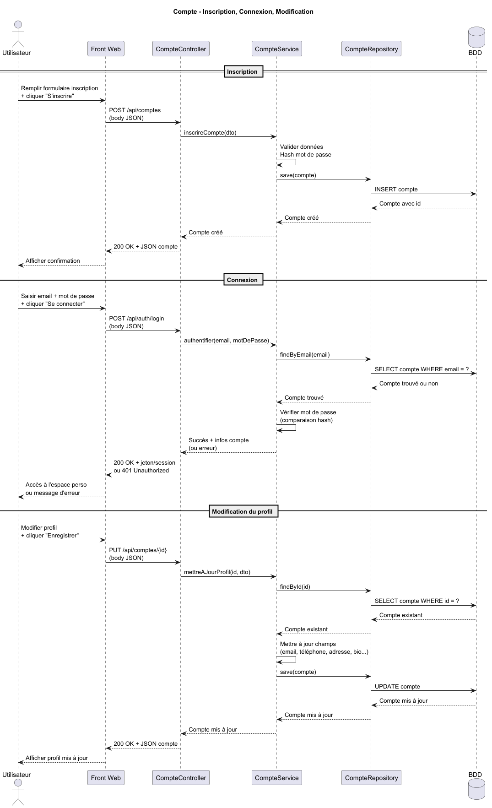
Aperçu de la page complète
  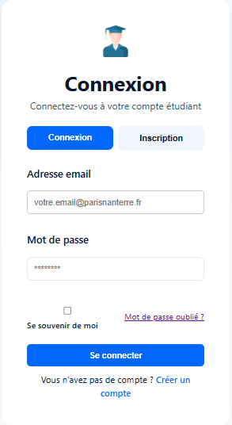
  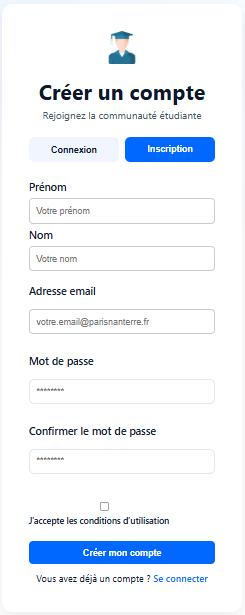
### 4.2 Communauté : Groupes & Recommandations Intelligentes
Cette fonctionnalité repose sur une logique de filtrage côté serveur pour proposer du contenu pertinent sans surcharger la base de données par des requêtes complexes.

#### Règles Métiers :
* **Accès Authentifié :** Seuls les utilisateurs connectés peuvent accéder à la liste des groupes recommandés.
* **Correspondance Hobbies :** Un groupe n'est recommandé que si sa catégorie correspond à l'un des "Hobbies" définis par l'utilisateur.
* **Exclusion des Adhésions :** Un utilisateur ne doit jamais se voir recommander un groupe dont il est déjà membre.
* **Lazy Loading :** Le chargement des listes de membres est optimisé pour éviter les boucles récursives JSON.

#### Classes Impliquées :
* `GroupeService` (Logique métier)
* `GroupeRepository` (Accès données)
* `Compte` (Entité utilisateur contenant le `Set<String> hobbies`)
* `Groupe` (Entité contenant la catégorie et la liste des membres)
#### Algorithme & Logique Backend :
  * Le backend implémente un algorithme de filtrage via l'API **Java Stream** dans `GroupeService`. Il récupère tous les groupes et applique un pipeline de filtres pour exclure les groupes déjà rejoints et ne garder que ceux correspondant aux centres d'intérêt.
  * La recommandation s'appuie sur la correspondance directe entre les attributs de l'utilisateur (ses centres d'intérêt) et les attributs des groupes (leur catégorie).

 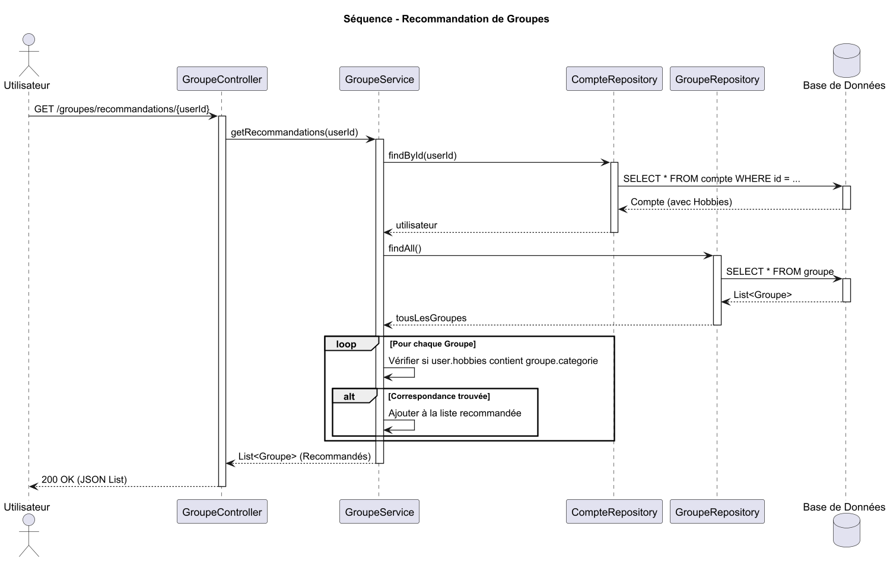
Aperçu de la page complète des groupes 
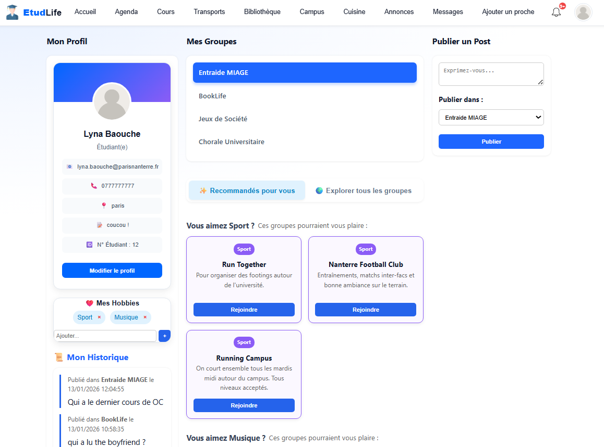
### 4.3 Réseau Social : Proches
La gestion des proches utilise une entité de liaison dédiée pour gérer la relation asymétrique ou symétrique entre deux comptes.

#### Règles Métiers :
* **Accès Authentifié :** Seuls les utilisateurs connectés peuvent gérer leur liste de proches.
* **Recherche Dynamique :** La barre de recherche permet de filtrer les utilisateurs par nom et prénom en temps réel.
* **Interdiction d'auto-ajout :** Un utilisateur ne peut pas s'ajouter lui-même en proche.
* **Unicité du lien :** Le système empêche la création de doublons si une relation existe déjà, le bouton "Ajouter" devient grisé avec la mention "Déjà Ajouté".
* **Notification :** L'ajout d'un proche déclenche automatiquement une notification.

#### Classes Impliquées :
* `LienService` (Gestion de la création et suppression)
* `Lien` (Entité de jointure `Compte` source -> `Compte` cible)
* `CompteService` (Pour la recherche utilisateur)
* `NotificationService` (Trigger événementiel)
#### Algorithme & Logique Backend :
  * **Création :** La méthode `creerLien` effectue d'abord une validation via `existsByCompteSourceIdAndCompteCibleId`. Si valide, l'entité `Lien` est persistée et le service appelle `notificationService.create`.
  * **Recherche :** Utilisation des **JPA Query Methods** optimisées : `findAllByNomIgnoreCaseAndPrenomIgnoreCase` dans le `CompteRepository` pour garantir la performance de la barre de recherche.
  * **Suppression Transactionnelle :** La suppression d'un ami utilise une transaction JPA stricte pour assurer l'intégrité de la base.

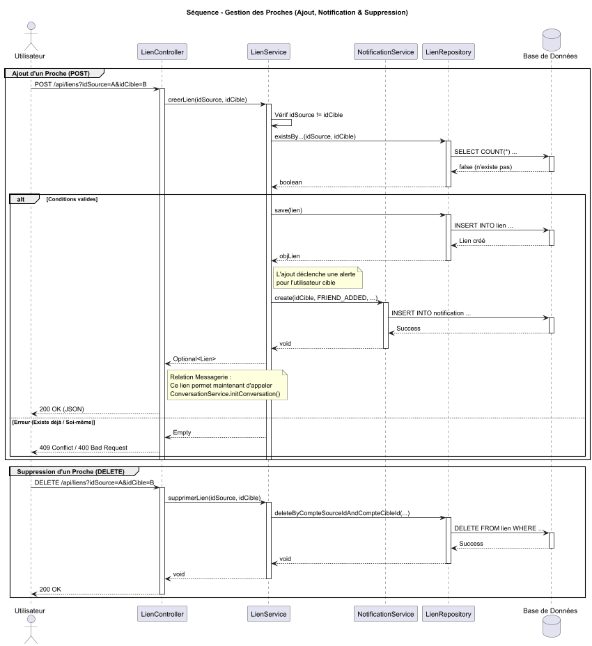

Voici l'aperçu de la page dédiée à l'ajout des proches et le gestion de ces derniers.

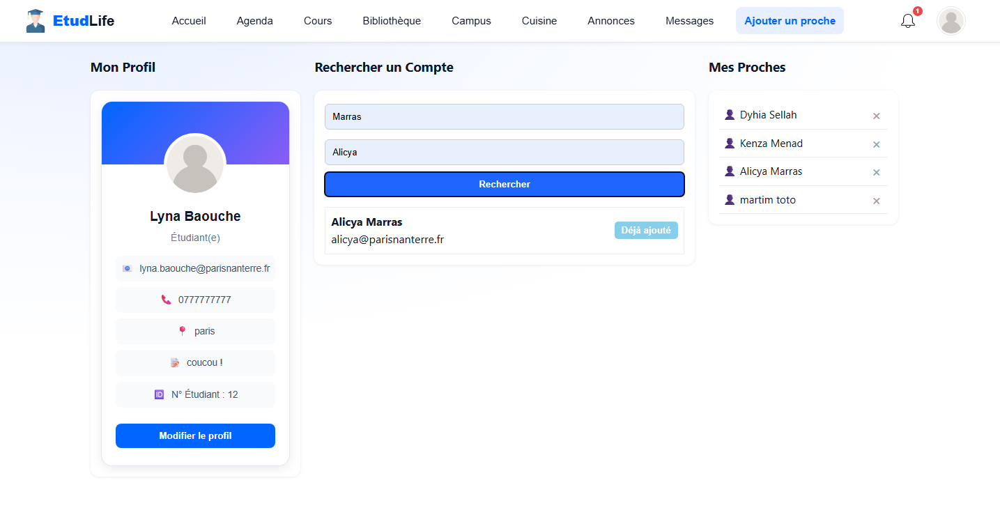
---
### 4.4 Organisation : Agenda Partagé
L'agenda repose sur une agrégation dynamique des événements de l'utilisateur et de ses proches.

##### Règles Métiers :
* **Accès authentifié** : seuls les utilisateurs connectés peuvent consulter et gérer l’agenda.
* **Visibilité Partagée :** La vue "Proches" doit afficher les événements de l'utilisateur connecté **ET** ceux de ses proches.
* **Agrégation SQL :** Utilisation d'une clause `IN` pour récupérer tous les événements en une seule requête performante.
* **Notification automatique** : l’ajout d’un événement déclenche une notification pour tous les proches.
#### Classes Impliquées :
* `EvenementService` (logique métier)
* `EvenementRepository` (accès aux données)
* `LienService` (récupération des identifiants des proches)
* `NotificationService` (envoi des notifications)
* `Evenement` (entité)

#### Fonctionnalités :
##### Gestion des événements
- Création d’événements personnels (titre, description, dates).
- modification d'un évenement existant.
- suppression d'un évenement.
- Association automatique de l’événement à l’utilisateur connecté.

##### Vue partagée avec les proches
- Accès à une vue *Agenda partagé* regroupant :
  - les événements de l’utilisateur,
  - les événements de ses proches.
- Les événements sont affichés de manière simultanée afin de faciliter la planification commune.
Aperçu de la page complète de l'agenda
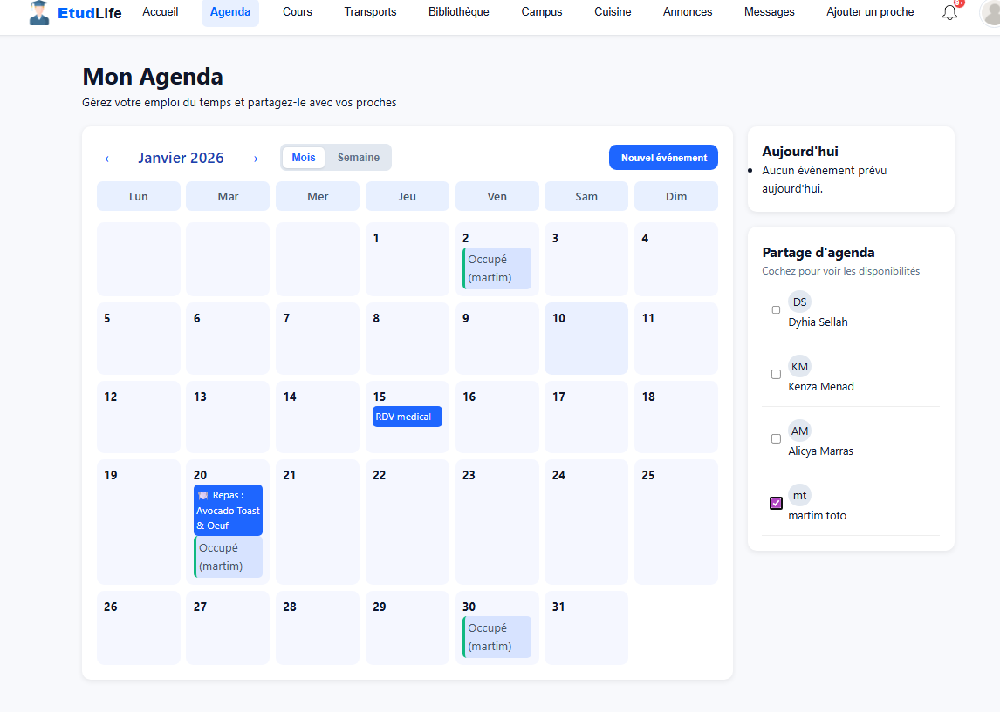
  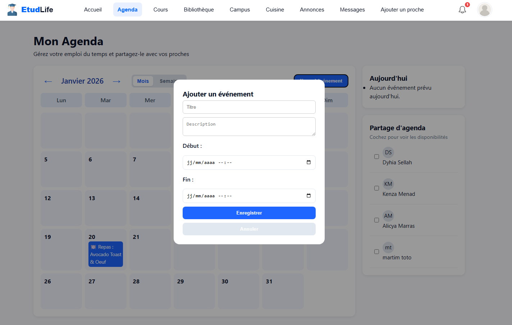
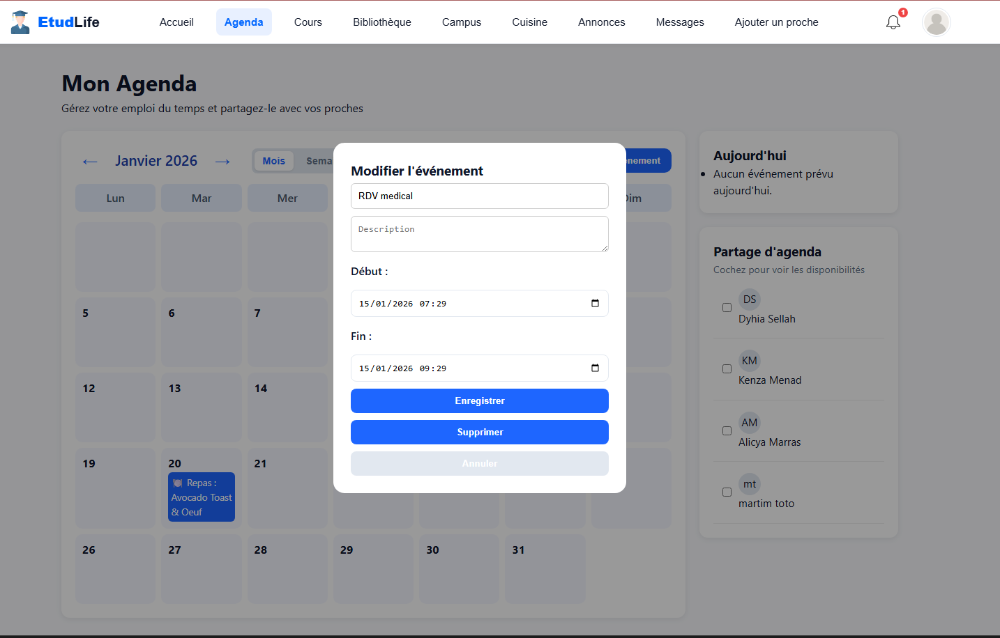
#### Algorithme & Logique Backend :
**création et modification et suppression des évenements de l'agenda:**

**Création d’un événement :**
Lors de l’ajout d’un événement, la méthode ajouter associe automatiquement l’événement à l’utilisateur connecté. La persistance est assurée par le EvenementService via save.

**Notification automatique :**
Après la création d’un événement, les identifiants des proches sont récupérés via le LienService. Pour chacun d’eux, le NotificationService.create est appelé afin d’envoyer une notification signalant l’ajout d’un nouvel événement dans l’agenda partagé.

**Modification et suppression :**
Les événements peuvent être modifiés ou supprimés via des endpoints REST dédiés. Les modifications sont immédiatement persistées en base de données et la suppression repose sur la méthode deleteById.

  **Agrégation (Vue Proches) :** La méthode `getSharedAvailability(Long myUserId)` fonctionne en deux temps :
  1.  Appel de `lienService.getProcheIds(myUserId)` pour obtenir une liste d'IDs (ex: `[ID_Ami1, ID_Ami2]`).
  2.  Ajout de l'ID de l'utilisateur courant à cette liste.
  3.  Exécution d'une requête JPA avec clause `IN` : `findByUtilisateurIdIn(List<Long> ids)` qui récupère en une seule requête SQL tous les événements concernés.
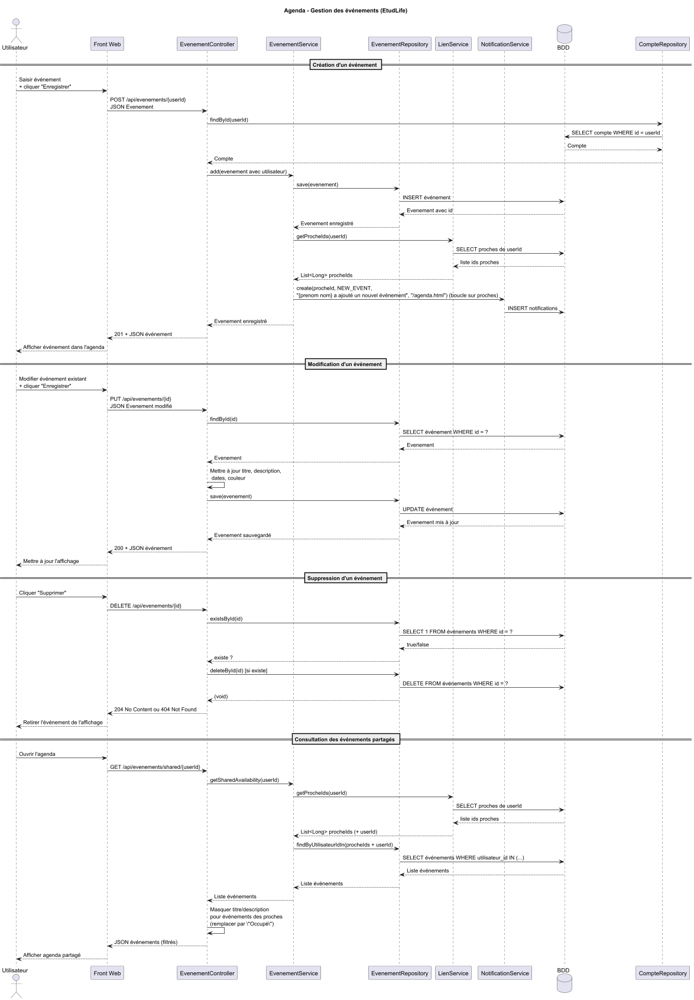


---
### 4.5 Vie Quotidienne : Cuisine
Le module cuisine combine une génération procédurale de menus et une gestion de favoris.

#### Règles Métiers :
* **Génération Aléatoire (Menu Semaine) :** Le système génère une combinaison unique de recettes pour chaque demande, couvrant 7 jours (Midi et Soir).
* **Rotation :** Si le nombre de recettes en base est insuffisant pour couvrir 14 repas (7 jours x 2), l'algorithme doit boucler sur les recettes existantes pour remplir la grille.
* **Favoris Persistants :** Les recettes favorites sont liées au compte utilisateur via une relation Many-to-Many.
* **Unicité des Favoris :** Une recette ne peut être ajoutée qu'une seule fois aux favoris d'un utilisateur (propriété du `Set`).
* ** Ajout de la recette à l'agenda :** L'utilisateur peut ajouter une recette sélectionnée directement à son agenda sous forme d'événement.

#### Classes Impliquées :
* `RecetteService` (Logique de génération)
* `CompteService` (Gestion des favoris)
* `Recette` (Entité métier avec ingrédients et catégories)

#### Algorithme & Logique Backend :
* **Génération du Menu :** La méthode `getMenuDeLaSemaine` récupère toutes les recettes, utilise `Collections.shuffle(all)` pour mélanger la liste aléatoirement, puis itère sur un tableau de jours (`Lundi`...`Dimanche`). Elle remplit une `Map` imbriquée (`Jour` -> `Midi/Soir`) en utilisant un index qui se réinitialise à 0 si la fin de la liste est atteinte.
* **Favoris :** Les méthodes `ajouterFavori` et `retirerFavori` manipulent directement la collection `Set<Recette> recettesFavorites` de l'entité `Compte`, assurant qu'une recette ne peut pas être en favori deux fois (propriété du `Set`)

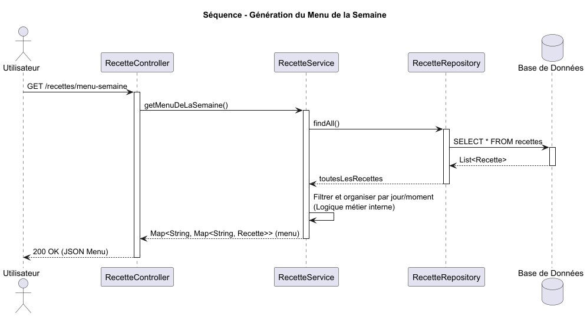

Aperçu de la page complète des recettes
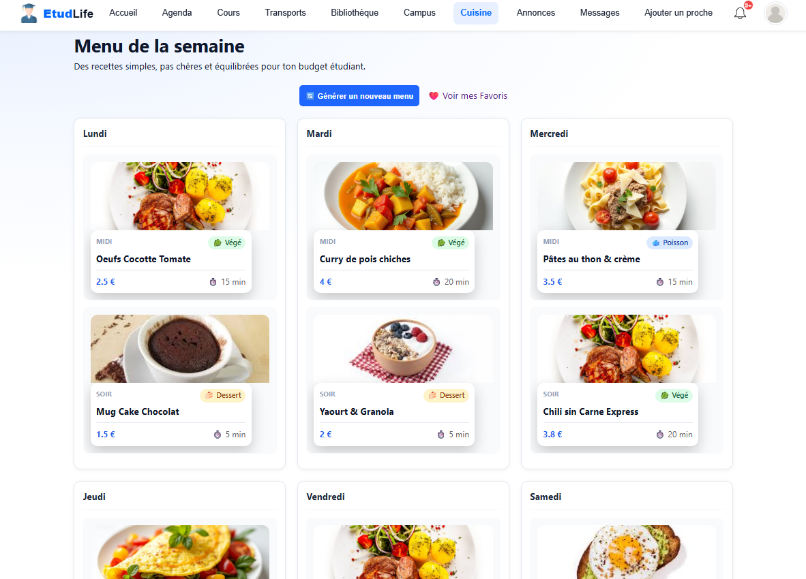
* Lorsque l'utilisateur clique sur une recette, il accède à une page détaillée avec :
  - Ingrédients
  - Étapes de préparation
  - Catégorie
  - Bouton pour ajouter aux favoris
  - Bouton pour ajouter à l'agenda
  
  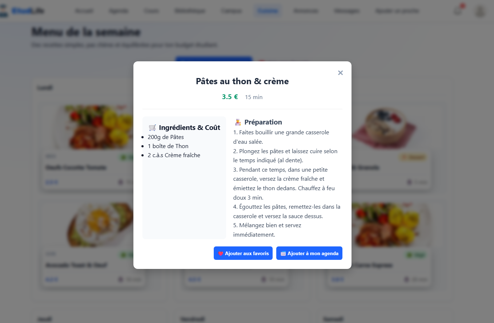

* Aperçu de la page des recettes mises en favoris 
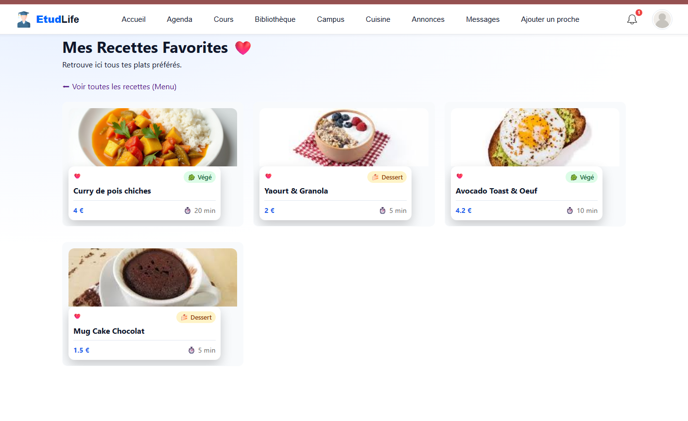
---

## 4.6 Module Ressources : Partage de Documents
Le module **Documents partagés** permet aux étudiants de mutualiser leurs supports de cours. Il repose sur un stockage physique de fichiers sécurisé sur le serveur.

#### Règles Métiers :
* **Accès Authentifié :** Seuls les utilisateurs connectés peuvent consulter, uploader ou télécharger des documents.
* **Intégrité des fichiers :** Chaque fichier uploadé est renommé avec un **timestamp unique** (ex: `1764151397017_cours.pdf`) pour éviter les écrasements en cas de noms identiques.
* **Persistance Hybride :** Le chemin relatif du fichier est stocké en base de données MySQL, tandis que le fichier binaire est conservé dans le dossier `/uploads` du serveur.

#### Fonctionnalités :
* **Consultation :** Liste dynamique de tous les documents disponibles avec affichage du type de fichier (PDF, ZIP, etc.).
* **Upload :** Formulaire de dépôt permettant d'ajouter un nouveau document depuis un poste local.
* **Download :** Lien direct permettant la récupération des ressources partagées par la communauté.

#### Classes Impliquées :
* `DocumentController` : Exposition des points d'entrée (endpoints) d'upload et de téléchargement.
* `DocumentService` : Logique de gestion des flux de fichiers, renommage et stockage disque.
* `Document` : Entité JPA stockant le nom original, le nom généré et le chemin serveur.


---

## 4.10 Module Bibliothèque : Le Pixel
Ce module centralise la gestion des ressources documentaires physiques et l'occupation des espaces de travail au sein de l'université Nanterre.

### 1 Présentation Générale
L'interface d'accueil de la bibliothèque, nommée **Le Pixel**, offre une vue d'ensemble et une navigation rapide vers les services essentiels : le catalogue, les réservations de places, le suivi personnel et les services annexes.

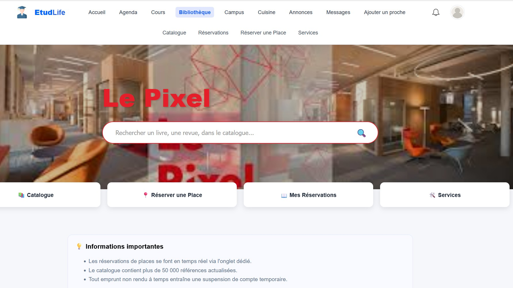
### 2 Catalogue & Réservation de Livres
Le catalogue permet aux étudiants d'accéder à une base de **15 247 ouvrages**.

* **Recherche & Filtrage :** Un moteur de recherche par titre, auteur ou ISBN ainsi qu'un filtrage par catégories thématiques facilitent la navigation.
* **Statut en temps réel :** L'état de chaque livre (**Disponible**, **Emprunté** ou **Réservé**) est affiché instantanément via des badges de couleur.
* **Action :** Un bouton "Réserver" permet d'ouvrir une interface de confirmation pour initier l'emprunt d'un ouvrage disponible.


### 3 Gestion Personnelle : Mes Réservations
Cette interface dédiée permet à l'étudiant de suivre son activité au sein de la bibliothèque de manière centralisée.

* **Suivi :** Affichage récapitulatif de tous les livres réservés avec les dates de récupération prévues.
* **Annulation :** Possibilité d'annuler une réservation active d'un simple clic en cas de changement de programme, libérant ainsi l'ouvrage pour les autres usagers.

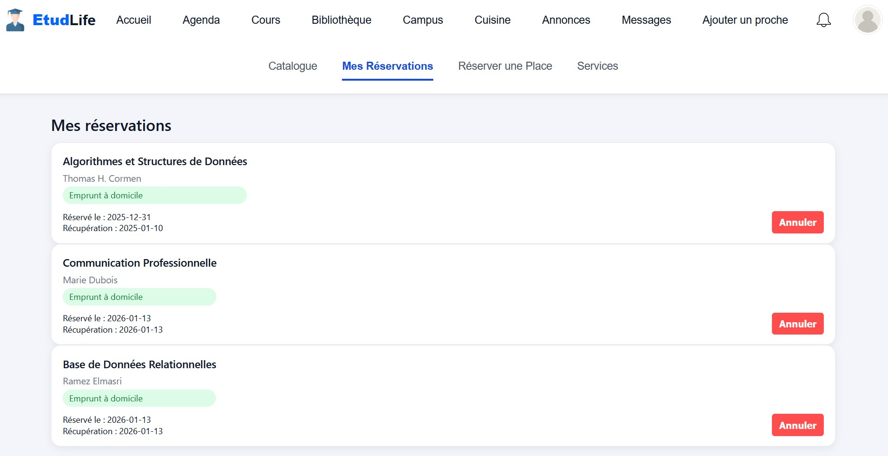

### 4 Réservation d'Espaces (Places)
Pour favoriser un environnement de travail adapté, l'application propose un système de réservation de places en temps réel.

* **Types de zones :** Places individuelles, Salles de groupe, Box silencieux et Salles informatiques.
* **Règle métier :** Pour garantir une rotation équitable, une réservation ne peut excéder **5 heures consécutives**.
* **Validation :** La saisie du numéro étudiant et du nom complet est requise pour assurer la traçabilité et la sécurité des espaces.

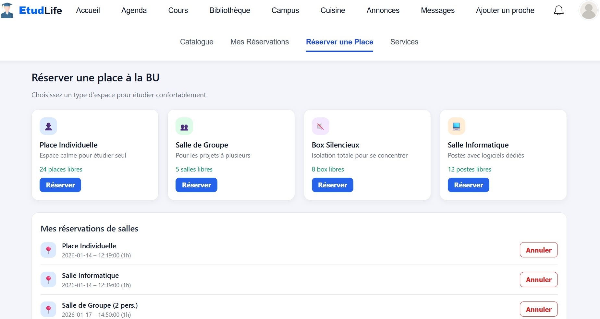

### 5 Services & Cartographie
L'onglet Services propose des outils d'assistance pratique pour faciliter le quotidien de l'étudiant sur le campus.

* **Plan Interactif :** Une carte visuelle permet de localiser les équipements essentiels tels que les **imprimantes** et les **scanners**.
* **Navigation Fluide :** Des boutons de raccourcis permettent de basculer rapidement vers le catalogue de livres ou le formulaire de réservation de place.

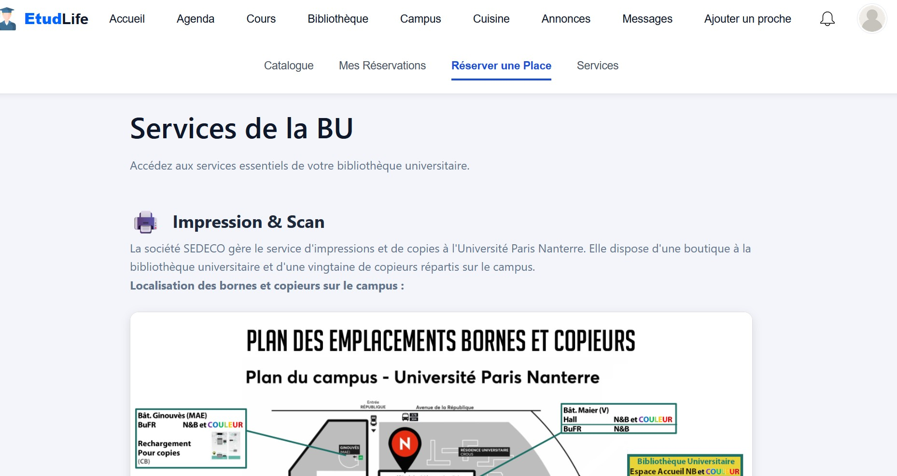

### Classes Impliquées (Backend)
Le fonctionnement de ces services repose sur l'architecture Spring Boot suivante :

* **`LivreController`** : Gère l'affichage, le filtrage et la recherche dans la base de données du catalogue.
* **`ReservationController`** : Traite la logique métier des flux d'emprunt et d'annulation des ouvrages.
* **`SalleController`** : Administre les réservations des espaces physiques et vérifie les contraintes horaires.
---
### 4.7 Petites Annonces
Le module **Petites Annonces** permet aux étudiants de publier, consulter et gérer des annonces afin de favoriser l’entraide au sein de la communauté étudiante (logement, cours particuliers, emplois, services, objets).

#### Règles Métiers :
* **Accès authentifié** : seules les utilisateurs connectés peuvent créer, modifier ou supprimer une annonce.
* **Propriété des annonces** : un utilisateur ne peut modifier ou supprimer que ses propres annonces.
* **Filtrage par catégorie** : les annonces peuvent être filtrées par catégorie.
* **Traçabilité** : chaque annonce conserve sa date de publication et son nombre de vues.
* **Notification automatique** : la création d’une annonce déclenche une notification pour les proches de l’auteur.

#### Fonctionnalités :
#### Consultation et recherche des annonces
- Accès à l’ensemble des annonces publiées par les étudiants.
- Barre de recherche permettant de filtrer les annonces par :Titre, description et catégorie :Logement, cours particuliers, emplois, services ,objets.
- Affichage dynamique du nombre d’annonces par catégorie.
- Présentation des annonces sous forme de cartes avec :image, titre, prix, localisation, date de publication.

#### Création d’une annonce
Tout utilisateur authentifié peut créer une annonce.
- Formulaire de création incluant :
  - Titre
  - Catégorie
  - Prix
  - Ville
  - Description
  - Lien externe optionnel
  - Image
- Les images sont stockées directement en base de données sous forme **Base64**.
- Initialisation automatique du nombre de vues à `0`.

##### Gestion des annonces personnelles
- Chaque utilisateur dispose d’une page **« Mes annonces »** regroupant les annonces qu’il a créées.
- Pour ses propres annonces, l’utilisateur peut :
  - **Modifier** une annonce existante
  - **Supprimer** une annonce
- Les modifications sont immédiatement persistées et visibles.

##### Système de favoris
- Les utilisateurs peuvent ajouter une annonce à leurs **favoris** afin de la conserver pour un usage ultérieur.

#### Classes Impliquées :
* `AnnonceController` (endpoints REST)
* `AnnonceService` (logique métier)
* `AnnonceRepository` (accès aux données)
* `Annonce` (entité)
* `LienRepository` (récupération des proches)
* `NotificationService` (création des notifications)

#### Algorithme & Logique Backend :

- Les annonces sont accessibles via des endpoints REST permettant de consulter toutes les annonces (findAll), de les filtrer par catégorie (findByCategorie) ou d’afficher celles d’un utilisateur spécifique (findByUtilisateurId).
- Lors de la création, les données sont validées puis persistées. L’image est convertie en Base64 avant stockage, et les champs de traçabilité (date de publication, nombre de vues) sont automatiquement initialisés.
- Après la publication d’une annonce, les proches de l’auteur sont récupérés via le système de liens, puis notifiés automatiquement à l’aide du NotificationService.
- Les annonces peuvent être modifiées ou supprimées.Les utilisateurs peuvent ajouter ou retirer une annonce de leurs favoris.
  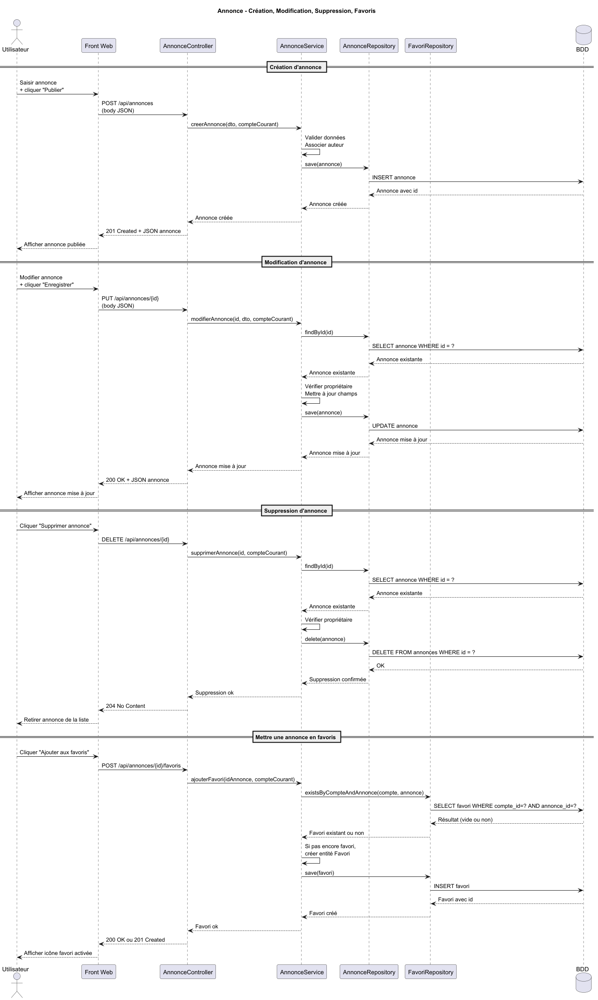
Aperçu de la page complète
   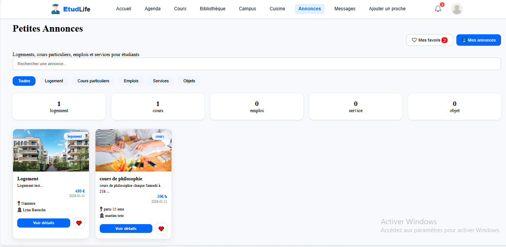
   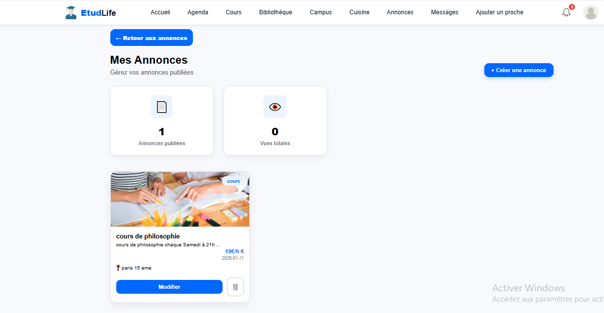
   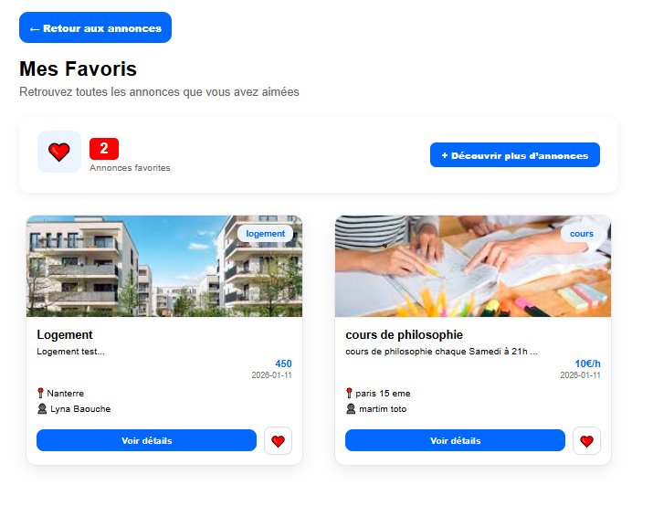
  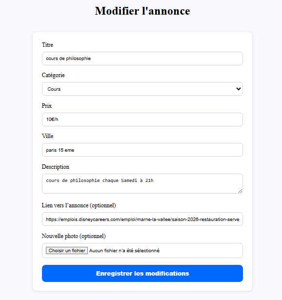
---
### 4.8 Système de notifications
Le système de notifications permet d’informer les utilisateurs des événements importants liés à leurs interactions sur la plateforme **EtudLife**.  

#### Règles Métiers :
* **Notification ciblée** : chaque notification est associée à un utilisateur précis.
* **Statut de lecture** : une notification peut être marquée comme lue ou non lue(en bleu==> n'est pas lue, en gris==> est lue)
* **Badge dynamique** : le nombre de notifications non lues est affiché sous forme d’un badge rouge.
* **Historisation** : toutes les notifications sont conservées et consultables.
* **Ordre chronologique** : les notifications sont affichées de la plus récente à la plus ancienne.

#### Types de notifications :

Un utilisateur reçoit une notification lorsqu’ :
- un étudiant l’ajoute comme **proche** (`FRIEND_ADDED`) ;
- un de ses proches :
  - publie une **nouvelle annonce** (`ANNONCE`) ;
  - ajoute un **nouvel événement** (`NEW_EVENT`) ;
- il reçoit un **nouveau message** (`NEW_MESSAGE`).

Chaque notification contient :
- un type (`NotificationType`) ;
- un message descriptif ;
- un lien de redirection ;
- une date de création ;
- un statut de lecture.

#### Fonctionnalités :

##### Indicateur de notifications
- Une icône de notification est accessible depuis la barre de navigation.
- Lorsqu’une ou plusieurs notifications sont reçues, un **badge rouge** affiche le nombre de notifications non lues.
- Ce compteur est calculé dynamiquement côté backend.

##### Consultation des notifications
- Un appel API permet de récupérer l’ensemble des notifications d’un utilisateur.
- Les notifications sont affichées par ordre chronologique décroissant.
- Un clic sur une notification permet d’accéder à la page concernée.

##### Page « Mes notifications »
- La page **Mes notifications** regroupe l’historique complet des notifications de l’utilisateur.
- Les notifications peuvent être marquées comme **lues** après consultation.


#### Classes Impliquées :

*  `NotificationController` (endpoints REST)
* `NotificationService` (logique métier)
*  `NotificationRepository` (accès aux données)
*  `Notification` (entité)
*  `NotificationType` (énumération des types de notification)

#### Algorithme & Logique Backend :

- la création d'une notification se fait par la méthode create lors d’actions déclenchées par les utilisateurs (publication d’une annonce, ajout d’un événement, ajout d’un proche).
- La récupération des notifications d’un utilisateur s’effectue via le NotificationRepository à l’aide de la méthode findByUserIdOrderByCreatedAtDesc, permettant d’afficher les notifications dans un ordre chronologique décroissant.
- Le compteur de notifications non lues repose sur la méthode countByUserIdAndIsReadFalse, utilisée pour l’affichage dynamique du badge. Lorsqu’une notification est consultée, la méthode markAsRead met à jour son état afin d’assurer une synchronisation immédiate entre le backend et l’interface utilisateur.
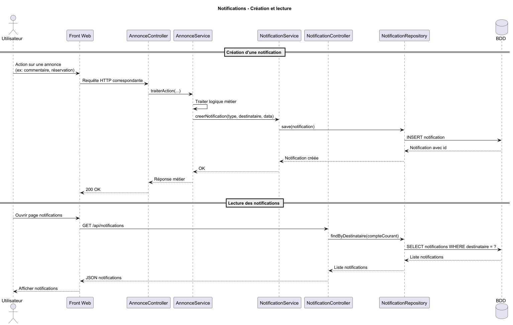
Aperçu de la page complète
  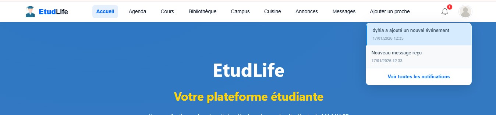
  
---

### 4.9 Système de Messagerie Instantanée

La messagerie instantanée est une composante centrale d'**EtudLife** qui favorise l'entraide et la communication. Elle permet aux étudiants d'échanger en temps réel avec leurs contacts ajoutés (les "Proches").

#### Règles Métiers :

* **Cercle de confiance** : un utilisateur ne peut initier une conversation qu'avec une personne faisant partie de sa liste de **Proches**.
* **Confidentialité** : les messages sont privés et visibles uniquement par l'expéditeur et le destinataire.
* **Intégrité** : un utilisateur peut supprimer ses propres messages, mais pas ceux de son interlocuteur.
* **Continuité** : l'historique des conversations est persistant, un utilisateur retrouve ses anciens échanges (sauf ceux supprimés) à chaque connexion.
* **Statut de présence** : un indicateur visuel permet de savoir si l'interlocuteur est actuellement **en ligne** ou hors ligne.

#### Fonctionnalités Principales :

##### 1. Gestion des Conversations

* **Vue synthétique** : L'écran principal affiche la liste de toutes les conversations actives.
* **Aperçu intelligent** : Pour chaque conversation, le système affiche le **dernier message échangé** ainsi que sa date, permettant de voir en un coup d'œil les discussions récentes.
* **Tri chronologique** : Les conversations ayant l'activité la plus récente apparaissent en haut de la liste.

##### 2. Échanges et Interactions

* **Envoi de messages** : L'envoi est instantané. Dès qu'un message est envoyé, une **notification** (`NEW_MESSAGE`) est déclenchée pour avertir le destinataire s'il n'est pas sur la page.
* **Suppression** : Un clic droit (ou appui long sur mobile) sur un message envoyé permet de le supprimer définitivement de la conversation via un menu contextuel.
* **Statut En Ligne** : Un système de "Heartbeat" (battement de cœur) signale la présence de l'utilisateur au serveur, mettant à jour son statut en temps réel pour ses amis.

##### 3. Interface Responsive (Mobile & Desktop)

L'interface a été conçue pour s'adapter aux usages modernes :

* **Version PC** : Une vue en deux colonnes (liste des contacts à gauche, chat actif à droite) pour une navigation fluide.
* **Version Mobile** : Une navigation fluide où la liste des conversations occupe tout l'écran, et bascule vers la vue "Chat" lors de la sélection d'un contact, avec un bouton de retour intuitif.

#### Aperçu de l'interface :

**Version Ordinateur (Vue globale)**

> *La vue classique permettant de naviguer entre les conversations tout en discutant.*


**Version Mobile (Liste & Discussion)**

> *L'interface s'adapte aux petits écrans en séparant la liste des contacts et la zone de discussion.*

<div style="display: flex; gap: 10px;">


</div>

#### Implémentation Technique :
Le système repose sur une architecture optimisée pour la réactivité :
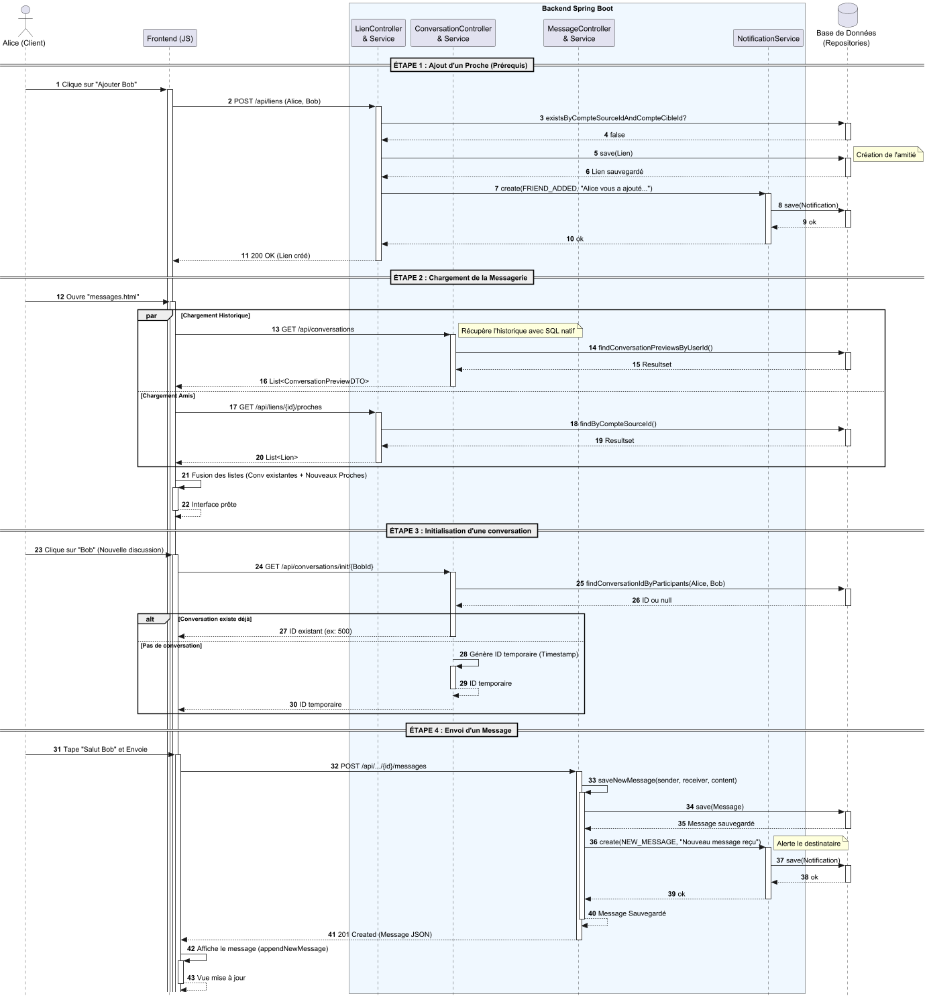

* **API REST** : Des endpoints dédiés (`/api/conversations`) gèrent la récupération et l'envoi des données.
* **Polling Dynamique** : Le frontend interroge périodiquement le serveur pour récupérer les nouveaux messages sans recharger la page (`getNewMessagesAfter`), garantissant une expérience proche du temps réel.
* **SQL Natif Optimisé** : Une requête complexe avec jointures est utilisée pour construire l'aperçu des conversations (récupération du dernier message et du bon interlocuteur en une seule requête) afin d'assurer de hautes performances.
---
## 4.10 Module Campus : Vie Universitaire

Le module **Campus** regroupe les informations pratiques pour aider les étudiants à se repérer et à se déplacer à l'Université Paris Nanterre.

### 1 Présentation Générale
La page propose une immersion visuelle avec un bandeau d'accueil et affiche les chiffres clés du campus : 35 000 étudiants, 10 UFR répartis sur 32 hectares, et une desserte par 4 grandes lignes de transport.


### 2 Principaux Bâtiments
Une grille interactive permet de situer les bâtiments selon les filières d'études :
* **Bâtiment ALLAIS :** Informatique et MIAGE.
* **Bâtiment VEIL :** Lettres et Langues.
* **Bâtiments ROUCH / RAMNOUX :** Droit, Économie et Gestion.
* **Bâtiments ZAZZO / LEFEBVRE :** Psychologie et Sociologie.
* **Bibliothèque (B.U) :** Espaces de révision et travail de groupe.


### 3 Transports et Accès
Récapitulatif des options pour se rendre sur le campus avec le temps de marche estimé :
* **RER A / Ligne L :** Gare de Nanterre Université (3 min).
* **Bus :** Lignes 159, 304, 367 (1 min).
* **Vélib :** Station disponible directement sur le site.

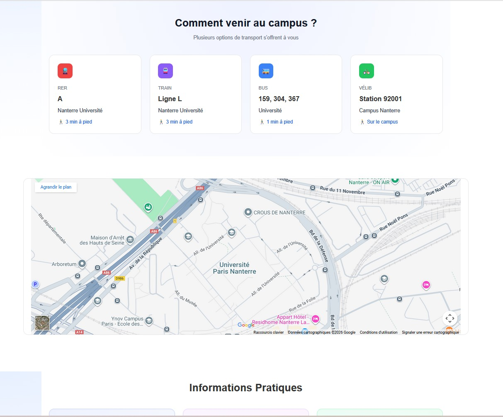
### 4 Informations Pratiques
Synthèse des services utiles au quotidien :
* **Horaires :** Ouverture de 7h30 à 20h00 en semaine.
* **Restauration :** Localisation des CROUS et cafétérias.
* **Services :** Accès au WiFi, espaces de coworking et centre médical.

### Architecture Technique
Ce module repose sur :
* **`campus.html`** : Structure de la page.
* **`style.css`** : Mise en page responsive (Grilles et icônes).
* **Iframe Google Maps** : Carte interactive pour la localisation.

### Architecture Technique & Classes Impliquées
Ce module est principalement informationnel et repose sur une structure optimisée pour la navigation et la performance :

* **`campus.html`** : Structure principale de la page utilisant des composants CSS modulaires.
* **`header.js`** : Assure la cohérence de la barre de navigation globale et le maintien de la session utilisateur.
* **`style.css`** : Gère la mise en page responsive (Flexbox et CSS Grid) pour l'affichage des bâtiments et des statistiques.
* **Intégration Iframe** : Appel à un service externe de cartographie pour la donnée géographique dynamique.
## 5. Matrice de Responsabilités & Réalisations

| Fonctionnalité                                          | Lyna Baouche | Alicya-Pearl Marras | Kenza Menad | Dyhia Sellah |
|---------------------------------------------------------|:------------:|:-------------------:|:-----------:|:------------:|
| Architecture Backend                                    |      ✅       |          ✅          |      ✅      |      ✅       |
| Gestion BDD                                             |      ⬜       |          ✅          |      ⬜      |      ⬜       |
| Gestion des Releases & CI/CD                            |      ✅       |          ⬜          |      ⬜      |      ⬜       |
| Documentation & UML                                     |      ✅       |          ✅          |      ✅      |      ✅       |
| Organisation & Pilotage Agile                           |      ✅       |          ✅          |      ✅      |      ✅       |
| Agenda (Mensuel / Hebdo / Proches)                      |      ✅       |          ⬜          |      ✅      |      ⬜       |
| Proches                                                 |      ✅       |          ⬜          |      ⬜      |      ⬜       |
| Messagerie                                              |      ⬜       |          ✅          |      ⬜      |      ⬜       |
| Groupes & Publications                                  |      ✅       |          ⬜          |      ⬜      |      ⬜       |
| Recettes                                                |      ✅       |          ⬜          |      ⬜      |      ⬜       |
| Système de notifications                                |      ⬜       |          ⬜          |      ✅      |      ⬜       |
| Annonces                                                |      ⬜       |          ⬜          |      ✅      |      ⬜       |
| Favoris annonce                                         |      ⬜       |          ⬜          |      ✅      |      ⬜       |
| Compte Utilisateur : Inscription, Connexion et Sécurité |      ⬜       |          ⬜          |      ✅      |      ⬜       |
| Modification du profil                                  |      ⬜       |          ⬜          |      ✅      |      ⬜       |
| Recommandation intelligente de groupes                  |      ✅       |          ⬜          |      ⬜      |      ⬜       |
| Documents partagés                                      |      ⬜       |          ⬜          |      ⬜      |      ✅       |
| Bibiliothèque                                           |      ⬜       |          ⬜          |      ⬜      |      ✅       |
| Tests Postman                                           |      ✅       |          ✅          |      ✅      |      ✅       |

## 6. Tests effectués

| Test                         | Type        | Argument Clé                                                                                            |
|------------------------------|-------------|---------------------------------------------------------------------------------------------------------|
| Agenda                       | Intégration | Valider la requête SQL (IN) et le croisement de données.                                                |
| Groupe                       | Unitaire    | Tester l'algorithme pur (Logique Java), rapidité, isolation (pas besoin de BDD).                        |
| Lien                         | Intégration | Valider l'effet de bord (1 action = 2 conséquences en BDD) et la communication entre services.          |
| Messagerie (MessageService)	 | Unitaire    | 	Garantir la sécurité critique (seul l'auteur peut supprimer son message) et les mocks de notification. |
| Messagerie (Conversation)	   | Unitaire	   | Vérifier la logique conditionnelle : retourner l'ID existant (BDD) OU générer un ID temporaire (Algo) si c'est une nouvelle discussion.|
| Messagerie & Proches         | Intégration | Valider la cohérence du scénario complet (Ajout Ami $\rightarrow$ Chat) et le bon fonctionnement de la requête SQL native complexe (Aperçus avec jointures). |


## 7. Guide d'Installation & Déploiement

### Prérequis
* Java 17 ou 21 installé.
* Accès Internet pour les dépendances Gradle.

### Commandes de lancement
```bash
./gradlew bootRun
