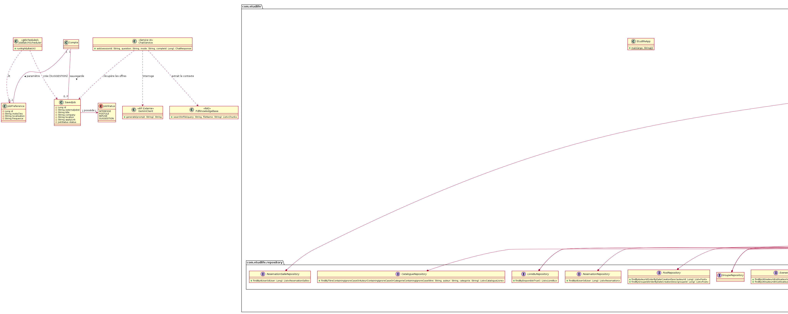

# Dossier Technique & Manuel Utilisateur
## Projet DevOps - Application EtudLife
**Version :** v0.3.0

**Auteurs :**
* Lyna Baouche
* Alicya-Pearl Marras
* Kenza Menad
* Dyhia Sellah

**Date :** 1er Janvier 2026

---

## 1. Présentation Générale

### 1.1 Objectif du Projet
Le projet **EtudLife** a pour vocation de centraliser les outils essentiels à la vie universitaire des étudiants de Nanterre. L'application vise à regrouper au sein d'une même interface les aspects sociaux, organisationnels et budgétaires de la vie étudiante.

### 1.2 Équipe & Contributeurs

| Membre | Rôle                                | GitHub                          |
| :--- |:------------------------------------|:--------------------------------|
| **Lyna Baouche** | Développeuse Fullstack / DevOps     | https://github.com/LynaBaouche  |
| **Alicya-Pearl Marras** | Développeuse Fullstack / DevOps     | https://github.com/alicyap      |
| **Kenza Menad** | Développeuse Fullstack / DevOps     | https://github.com/kenza-menad  |
| **Dyhia Sellah** | Développeuse Fullstack / DevOps     | https://github.com/DyhiaSellah1 |

### 1.3 Gestion de Projet & DevOps

Nous avons adopté une méthodologie inspirée des méthodes **Agile/Scrum**, adaptée à notre contexte universitaire et aux contraintes du projet.

* **Pilotage Agile (Lead : Lyna Baouche) :**
    * Organisation et pilotage des réunions de chaque sprint.
    * **Weekly Stand-up :** Remplacement du "Daily" par un point hebdomadaire pour synchroniser l'équipe.
    * **Sprints :** Cycles de développement courts ponctués par des releases.

* **Outils de Gestion :**
    * **Jira :** Suivi des tickets fonctionnels (Stories).
    * **Trello :** Gestion du Backlog technique.
    * **GitHub :** Gestion de version.

* **Pipeline CI/CD & Automatisation (Implémentation : Lyna Baouche) :**
  L'intégration et le déploiement sont automatisés via **GitHub Actions**.
    * **Gestion des Releases :** Création automatique des tags et des releases GitHub.
    * **Documentation :** Génération automatique des assets de release pour la documentation.
    * **UML :** Mise à jour automatique du diagramme de classe PlantUML à chaque push sur la branche principale via un workflow dédié (`update-uml.yml`).

---

## 2. Analyse Concurrentielle & UX

### 2.1 Étude de la concurrence
Comparaison effectuée avec les ENT classiques (Moodle) et les applications de BDE existantes.

### 2.2 Utilisabilité & Design
* **Interface :** Design System cohérent avec une palette dominante bleue.
* **Accessibilité :** Navigation simplifiée et responsive.
* **Architecture :** Simulation d'une Single Page Application (SPA).

---

## 3. Architecture Technique

### 3.1 Stack Technologique

L'application repose sur une architecture **REST API** robuste développée avec l'écosystème Spring.

**Backend :**
* **Langage :** Java 17 / 21.
* **Framework :** Spring Boot 3.
* **Architecture :** Modèle MVC / REST (Controller, Service, Repository).
* **ORM :** Hibernate (via Spring Data JPA).
* **API :** Architecture RESTful (Controller, Service, Repository).

**Base de Données :**
* **SGBD :** MySQL.
* **Hébergement :** AlwaysData (Cloud).

**Frontend :**
* **Technologies :** HTML5, CSS3, JavaScript (Vanilla).
* **Build Environment :** Gradle.

**Qualité & Tests :**
* **API Testing :** Une collection **Postman** complète a été intégrée pour valider les endpoints de l'API REST et assurer la non-régression.

### 3.2 Modélisation (UML) & Structure des Données

La modélisation s'articule autour de l'entité centrale **`Compte`**, qui représente l'étudiant et interagit avec les différents modules de l'application.

#### 1. Cœur du système : Utilisateur (`Compte`)
L'entité `Compte` centralise les informations personnelles (Email, Bio, Hobbies) et sert de pivot pour toutes les relations :
* **Authentification :** Stocke l'email (identifiant unique) et le mot de passe hashé.
* **Hobbies :** Une collection simple (`ElementCollection`) stocke les centres d'intérêt (ex: "Musique", "Sport") utilisés par l'algorithme de recommandation.

#### 2. Module Communautaire (`Groupe` & `Post`)
Ce module gère les interactions de groupe.
* **Relation `Compte` - `Groupe` (Many-to-Many) :** Un étudiant peut rejoindre plusieurs groupes, et un groupe contient plusieurs membres. Cette relation est gérée par la table de jointure `groupe_membres`.
* **Entité `Post` :** Représente une publication. Elle fait le lien (Many-to-One) entre :
    * Un **Auteur** (`Compte`) : Qui a écrit le message.
    * Un **Groupe** (`Groupe`) : Où le message est publié.

#### 3. Module Réseau Social (`Lien`)
Le système de "Proches" n'est pas une simple liste, mais une entité dédiée pour permettre plus de flexibilité.
* **Entité `Lien` :** Elle matérialise une relation orientée entre deux comptes :
    * `compteSource` : Celui qui ajoute.
    * `compteCible` : Celui qui est ajouté.
* Cette structure permet de gérer la date de création du lien (`dateCreation`) et facilite les requêtes asymétriques.

#### 4. Module Organisation & Vie Quotidienne
* **Agenda (`Evenement`) :**
    * Relation **One-to-Many** avec `Compte`. Chaque événement (Titre, Date début/fin, Couleur) appartient à un utilisateur spécifique.
    * Les événements des "Proches" sont récupérés via des requêtes croisées, sans lien direct en base de données.
* **Cuisine (`Recette`) :**
    * Les recettes sont des entités indépendantes (catalogue global).
    * Relation **Many-to-Many** (`favoris_recettes`) : Permet aux utilisateurs de se constituer une liste de recettes favorites personnelles.
* **Annonces :**
- Les annonces sont des entités créées par les utilisateurs afin de favoriser l’entraide étudiante.
- Relation **One-to-Many** avec `Compte` via l’identifiant de l’utilisateur (`utilisateur_id`).
- Chaque annonce contient des informations détaillées (titre, description, prix, catégorie, image, localisation, date de publication).
- Les utilisateurs peuvent :
    - créer,
    - modifier,
    - supprimer leurs propres annonces.
- Un système de **favoris d’annonces** permet de sauvegarder des annonces d’intérêt personnel.
- La publication d’une annonce déclenche une notification automatique vers les proches de l’auteur.
* **Document :**
* **Messagerie :**
#### 5. Système de Notification
* **Entité `Notification` :** Liée à un `Compte` (le destinataire), elle stocke le type d'action (`FRIEND_ADDED`, `NEW_EVENT`, `ANNONCE`, `NEW_MESSAGE`), le message et un lien de redirection, permettant une interaction asynchrone entre les utilisateurs.


Le diagramme étant complexe, nous recommandons de l'ouvrir dans un nouvel onglet :
🔗 **[Voir le Diagramme de Classes Complet (Zoomable)](diagram-zoomable.svg)**

---

## 4. Fonctionnalités Détaillées (User Guide)
### 4.1 Authentification & Sécurité

L’authentification est un pré-requis indispensable pour accéder à la plateforme **EtudLife**.  
Sans compte utilisateur valide et sans session active, l’accès aux fonctionnalités principales
(messagerie, annonces, agenda, documents, groupes) est strictement restreint.

#### Règles Métiers :
    *- **Accès restreint** : seuls les utilisateurs authentifiés peuvent accéder à la plateforme.
    *- **Email universitaire obligatoire** : l’inscription est autorisée uniquement avec une adresse se terminant par `@parisnanterre.fr`.
    *- **Email unique** : une adresse email ne peut être associée qu’à un seul compte.
    *- **Mot de passe sécurisé** : le mot de passe doit contenir des caractères autres que des lettres (chiffres et/ou caractères spéciaux).
    *- **Validation serveur** : toutes les règles de sécurité sont appliquées côté backend.
    *- **Sécurité des mots de passe** : aucun mot de passe n’est stocké en clair.
    *- **Traçabilité de connexion** : la dernière activité de l’utilisateur est enregistrée.


#### Fonctionnalités :

##### Inscription
- Création de compte via une adresse email valide.
- Vérification des champs obligatoires (nom, prénom, email, mot de passe).
- Contrôle de l’unicité de l’adresse email via le `CompteRepository`.
- Hashage sécurisé du mot de passe avant enregistrement en base de données.

##### Connexion
- Authentification par email et mot de passe.
- Vérification sécurisée des identifiants côté backend.
- Mise à jour de la date de dernière connexion (`lastConnection`).
- Retour des informations utilisateur après authentification réussie.

##### Gestion du profil utilisateur
- Chaque utilisateur dispose d’une page **Profil** accessible après authentification.
- L’utilisateur peut modifier ses informations personnelles, notamment :numéro de téléphone, adresse, biographie...
- Les modifications sont effectuées via l’option **« Modifier le profil »**.
- Les données mises à jour sont immédiatement persistées en base de données.


#### Classes Impliquées :
     * `CompteController` (exposition des endpoints REST)
     * `CompteService` (logique métier d’authentification)
     * `CompteRepository` (accès aux données utilisateurs)
     * `Compte` (entité utilisateur)
     * `BCryptPasswordEncoder` (hashage des mots de passe)


#### Algorithme & Logique Backend :

Lors de l’inscription, le service vérifie l’existence préalable d’un compte via l’email.
Si l’email est déjà présent en base, la création est refusée.

Le mot de passe fourni est hashé à l’aide de **BCrypt** avant d’être persisté, garantissant
une protection efficace contre les attaques par compromission de base de données.

Lors de la connexion, le mot de passe saisi est comparé au hash stocké via la méthode `matches`,
sans jamais exposer le mot de passe original.

```java

//INSCRIPTION : hashage du mot de passe

String motDePasseHash = passwordEncoder.encode(compte.getMotDePasse());
compte.setMotDePasse(motDePasseHash);

// CONNEXION : vérification du mot de passe

if (!passwordEncoder.matches(motDePasse, compte.getMotDePasse())) {
    throw new IllegalArgumentException("Mot de passe incorrect.");
}
```
---

### 4.2 Communauté : Groupes & Recommandations Intelligentes
Cette fonctionnalité repose sur une logique de filtrage côté serveur pour proposer du contenu pertinent sans surcharger la base de données par des requêtes complexes.

#### Règles Métiers :
    * **Correspondance Hobbies :** Un groupe n'est recommandé que si sa catégorie correspond à l'un des "Hobbies" définis par l'utilisateur.
    * **Exclusion des Adhésions :** Un utilisateur ne doit jamais se voir recommander un groupe dont il est déjà membre.
    * **Lazy Loading :** Le chargement des listes de membres est optimisé pour éviter les boucles récursives JSON.

#### Classes Impliquées :
    * `GroupeService` (Logique métier)
    * `GroupeRepository` (Accès données)
    * `Compte` (Entité utilisateur contenant le `Set<String> hobbies`)
    * `Groupe` (Entité contenant la catégorie et la liste des membres)
#### Algorithme & Logique Backend :
  Le backend implémente un algorithme de filtrage via l'API **Java Stream** dans `GroupeService`. Il récupère tous les groupes et applique un pipeline de filtres pour exclure les groupes déjà rejoints et ne garder que ceux correspondant aux centres d'intérêt.

```java
    // Extrait de GroupeService.java
    public List<Groupe> getRecommandations(Long userId) {
        Compte user = compteRepository.findById(userId).orElseThrow();
        Set<String> userHobbies = user.getHobbies();
        List<Groupe> allGroupes = groupeRepository.findAll();

        return allGroupes.stream()
                // 1. Filtrer : On garde seulement si la catégorie correspond aux hobbies
                .filter(g -> g.getCategorie() != null && userHobbies.contains(g.getCategorie()))
                // 2. Filtrer : On exclut les groupes où je suis déjà membre
                .filter(g -> g.getMembres().stream().noneMatch(m -> m.getId().equals(userId)))
                .collect(Collectors.toList());
    }
```    
            
---
### 4.3 Réseau Social : Proches
La gestion des proches utilise une entité de liaison dédiée pour gérer la relation asymétrique ou symétrique entre deux comptes.

#### Règles Métiers :
    * **Interdiction d'auto-ajout :** Un utilisateur ne peut pas s'ajouter lui-même en proche.
    * **Unicité du lien :** Le système empêche la création de doublons si une relation existe déjà.
    * **Notification :** L'ajout d'un proche déclenche automatiquement une notification.

#### Classes Impliquées :
    * `LienService` (Gestion de la création et suppression)
    * `Lien` (Entité de jointure `Compte` source -> `Compte` cible)
    * `CompteService` (Pour la recherche utilisateur)
    * `NotificationService` (Trigger événementiel)
#### Algorithme & Logique Backend :
  * **Création :** La méthode `creerLien` effectue d'abord une validation via `existsByCompteSourceIdAndCompteCibleId`. Si valide, l'entité `Lien` est persistée et le service appelle `notificationService.create`.
  * **Recherche :** Utilisation des **JPA Query Methods** optimisées : `findAllByNomIgnoreCaseAndPrenomIgnoreCase` dans le `CompteRepository` pour garantir la performance de la barre de recherche.

    ```java
    // Extrait de LienService.java
    public Optional<Lien> creerLien(Long idSource, Long idCible) {
        // 1. Règle métier : On empêche de s'ajouter soi-même
        if (idSource.equals(idCible)) return Optional.empty();

        // 2. Règle métier : Vérification d'unicité
        if (lienRepository.existsByCompteSourceIdAndCompteCibleId(idSource, idCible)) {
            return Optional.empty();
        }

        // Création et Notification
        Lien lien = new Lien(source.get(), cible.get());
        Lien saved = lienRepository.save(lien);

        notificationService.create(
                cible.get().getId(),
                NotificationType.FRIEND_ADDED,
                source.get().getNom() + " vous a ajouté comme proche",
                "/proches.html#mes-proches"
        );
        return Optional.of(saved);
    }
    ```
---
### 4.4 Organisation : Agenda Partagé
L'agenda repose sur une agrégation dynamique des événements de l'utilisateur et de ses proches.

##### Règles Métiers :
    * **Accès authentifié** : seuls les utilisateurs connectés peuvent consulter et gérer l’agenda.
    * **Visibilité Partagée :** La vue "Proches" doit afficher les événements de l'utilisateur connecté **ET** ceux de ses proches.
    * **Agrégation SQL :** Utilisation d'une clause `IN` pour récupérer tous les événements en une seule requête performante.
    * **Notification automatique** : l’ajout d’un événement déclenche une notification pour tous les proches.
#### Classes Impliquées :
     * - `EvenementService` (logique métier)
     * - `EvenementRepository` (accès aux données)
     * - `LienService` (récupération des identifiants des proches)
     * - `NotificationService` (envoi des notifications)
     * - `Evenement` (entité)

#### Fonctionnalités :
##### Gestion des événements
- Création d’événements personnels (titre, description, dates).
- Association automatique de l’événement à l’utilisateur connecté.

##### Vue partagée avec les proches
- Accès à une vue *Agenda partagé* regroupant :
  - les événements de l’utilisateur,
  - les événements de ses proches.
- Les événements sont affichés de manière simultanée afin de faciliter la planification commune.

#### Algorithme & Logique Backend :
  **Agrégation (Vue Proches) :** La méthode `getSharedAvailability(Long myUserId)` fonctionne en deux temps :
  1.  Appel de `lienService.getProcheIds(myUserId)` pour obtenir une liste d'IDs (ex: `[ID_Ami1, ID_Ami2]`).
  2.  Ajout de l'ID de l'utilisateur courant à cette liste.
  3.  Exécution d'une requête JPA avec clause `IN` : `findByUtilisateurIdIn(List<Long> ids)` qui récupère en une seule requête SQL tous les événements concernés.
    ```java
    // Extrait de EvenementService.java
    public List<Evenement> getSharedAvailability(Long myUserId) {
        // 1. Récupérer les IDs des amis via le LienService
        List<Long> procheIds = lienService.getProcheIds(myUserId);
        
        // 2. Ajouter mon propre ID à la liste
        procheIds.add(myUserId);

        // 3. Requête optimisée (SELECT * FROM Event WHERE user_id IN (...))
        return evenementRepository.findByUtilisateurIdIn(procheIds);
    }
    ```
---
### 4.5 Vie Quotidienne : Cuisine
Le module cuisine combine une génération procédurale de menus et une gestion de favoris.

#### Règles Métiers :
    * **Génération Aléatoire (Menu Semaine) :** Le système génère une combinaison unique de recettes pour chaque demande, couvrant 7 jours (Midi et Soir).
    * **Rotation :** Si le nombre de recettes en base est insuffisant pour couvrir 14 repas (7 jours x 2), l'algorithme doit boucler sur les recettes existantes pour remplir la grille.
    * **Favoris Persistants :** Les recettes favorites sont liées au compte utilisateur via une relation Many-to-Many.

#### Classes Impliquées :
    * `RecetteService` (Logique de génération)
    * `CompteService` (Gestion des favoris)
    * `Recette` (Entité métier avec ingrédients et catégories)

#### Algorithme & Logique Backend :
    * **Génération du Menu :** La méthode `getMenuDeLaSemaine` récupère toutes les recettes, utilise `Collections.shuffle(all)` pour mélanger la liste aléatoirement, puis itère sur un tableau de jours (`Lundi`...`Dimanche`). Elle remplit une `Map` imbriquée (`Jour` -> `Midi/Soir`) en utilisant un index qui se réinitialise à 0 si la fin de la liste est atteinte.
    * **Favoris :** Les méthodes `ajouterFavori` et `retirerFavori` manipulent directement la collection `Set<Recette> recettesFavorites` de l'entité `Compte`, assurant qu'une recette ne peut pas être en favori deux fois (propriété du `Set`).

```java
    // Extrait de RecetteService.java
    public Map<String, Map<String, Recette>> getMenuDeLaSemaine() {
        List<Recette> all = recetteRepository.findAll();
        Collections.shuffle(all); // Mélange aléatoire pour varier les menus

        Map<String, Map<String, Recette>> menuSemaine = new LinkedHashMap<>();
        String[] jours = {"Lundi", "Mardi", "Mercredi", "Jeudi", "Vendredi", "Samedi", "Dimanche"};
        int index = 0;

        for (String jour : jours) {
            Map<String, Recette> repasJour = new HashMap<>();

            // Distribution Midi / Soir avec boucle (index reset)
            if (index < all.size()) repasJour.put("midi", all.get(index++));
            else index = 0; 

            if (index < all.size()) repasJour.put("soir", all.get(index++));
            else index = 0;

            menuSemaine.put(jour, repasJour);
        }
        return menuSemaine;
    }
    
```    
            
---


### 4.6 Ressources: Partage de Documents
* Upload et gestion de fichiers (PDF, DOCX).
---
### 4.7 Petites Annonces
Le module **Petites Annonces** permet aux étudiants de publier, consulter et gérer des annonces afin de favoriser l’entraide au sein de la communauté étudiante (logement, cours particuliers, emplois, services, objets).

#### Règles Métiers :
    * - **Accès authentifié** : seules les utilisateurs connectés peuvent créer, modifier ou supprimer une annonce.
    * - **Propriété des annonces** : un utilisateur ne peut modifier ou supprimer que ses propres annonces.
    * - **Filtrage par catégorie** : les annonces peuvent être filtrées par catégorie.
    * - **Traçabilité** : chaque annonce conserve sa date de publication et son nombre de vues.
    * - **Notification automatique** : la création d’une annonce déclenche une notification pour les proches de l’auteur.

#### Fonctionnalités :
#### Consultation et recherche des annonces
- Accès à l’ensemble des annonces publiées par les étudiants.
- Barre de recherche permettant de filtrer les annonces par :Titre, description et catégorie :Logement, cours particuliers, emplois, services ,objets.
- Affichage dynamique du nombre d’annonces par catégorie.
- Présentation des annonces sous forme de cartes avec :image, titre, prix, localisation, date de publication.

#### Création d’une annonce
Tout utilisateur authentifié peut créer une annonce.
- Formulaire de création incluant :
  - Titre
  - Catégorie
  - Prix
  - Ville
  - Description
  - Lien externe optionnel
  - Image
- Les images sont stockées directement en base de données sous forme **Base64**.
- Initialisation automatique du nombre de vues à `0`.

##### Gestion des annonces personnelles
- Chaque utilisateur dispose d’une page **« Mes annonces »** regroupant les annonces qu’il a créées.
- Pour ses propres annonces, l’utilisateur peut :
  - **Modifier** une annonce existante
  - **Supprimer** une annonce
- Les modifications sont immédiatement persistées et visibles.

##### Système de favoris
- Les utilisateurs peuvent ajouter une annonce à leurs **favoris** afin de la conserver pour un usage ultérieur.

#### Classes Impliquées :
     * - `AnnonceController` (endpoints REST)
     * - `AnnonceService` (logique métier)
     * - `AnnonceRepository` (accès aux données)
     * - `Annonce` (entité)
     * - `LienRepository` (récupération des proches)
     * - `NotificationService` (création des notifications)

#### Algorithme & Logique Backend :

La récupération des annonces s’effectue via des endpoints REST permettant :
- la récupération globale ;
- le filtrage par catégorie ;
- la récupération des annonces d’un utilisateur donné.

Lors de la création d’une annonce :
1. Les données sont validées.
2. L’image est convertie en **Base64** si elle est fournie.
3. L’annonce est persistée en base de données.
4. Les proches de l’auteur sont récupérés via le `LienRepository`.
5. Une notification est envoyée à chaque proche.

```java
Annonce saved = service.save(annonce);

List<Lien> liens = lienRepository.findByCompteSourceId(utilisateurId);

for (Lien lienProche : liens) {
    Compte proche = lienProche.getCompteCible();
    if (proche != null) {
        notificationService.create(
            proche.getId(),
            NotificationType.ANNONCE,
            auteur + " a publié une nouvelle annonce.",
            "/Annonce/annonces.html"
        );
    }
}
```
---
### 4.8 Système de notifications
Le système de notifications permet d’informer les utilisateurs des événements importants liés à leurs interactions sur la plateforme **EtudLife**.  

#### Règles Métiers :
    * - **Notification ciblée** : chaque notification est associée à un utilisateur précis.
    * - **Statut de lecture** : une notification peut être marquée comme lue ou non lue(en bleu==> n'est pas lue, en gris==> est lue)
    * - **Badge dynamique** : le nombre de notifications non lues est affiché sous forme d’un badge rouge.
    * - **Historisation** : toutes les notifications sont conservées et consultables.
    * - **Ordre chronologique** : les notifications sont affichées de la plus récente à la plus ancienne.

#### Types de notifications :

Un utilisateur reçoit une notification lorsqu’ :
- un étudiant l’ajoute comme **proche** (`FRIEND_ADDED`) ;
- un de ses proches :
  - publie une **nouvelle annonce** (`ANNONCE`) ;
  - ajoute un **nouvel événement** (`NEW_EVENT`) ;
- il reçoit un **nouveau message** (`NEW_MESSAGE`).

Chaque notification contient :
- un type (`NotificationType`) ;
- un message descriptif ;
- un lien de redirection ;
- une date de création ;
- un statut de lecture.

#### Fonctionnalités :

##### Indicateur de notifications
- Une icône de notification est accessible depuis la barre de navigation.
- Lorsqu’une ou plusieurs notifications sont reçues, un **badge rouge** affiche le nombre de notifications non lues.
- Ce compteur est calculé dynamiquement côté backend.

##### Consultation des notifications
- Un appel API permet de récupérer l’ensemble des notifications d’un utilisateur.
- Les notifications sont affichées par ordre chronologique décroissant.
- Un clic sur une notification permet d’accéder à la page concernée.

##### Page « Mes notifications »
- La page **Mes notifications** regroupe l’historique complet des notifications de l’utilisateur.
- Les notifications peuvent être marquées comme **lues** après consultation.


#### Classes Impliquées :
     * - `NotificationController` (endpoints REST)
     * - `NotificationService` (logique métier)
     * - `NotificationRepository` (accès aux données)
     * - `Notification` (entité)
     * - `NotificationType` (énumération des types de notification)

#### Algorithme & Logique Backend :

La création d’une notification est centralisée dans le `NotificationService`.  
Lorsqu’un événement métier survient (ajout d’un proche, création d’annonce, événement, message), le service concerné appelle la méthode `create(...)`.

Les notifications sont stockées en base de données avec :
- un identifiant utilisateur ;
- un statut de lecture (`isRead`) ;
- une date de création automatique.

Le nombre de notifications non lues est calculé via une requête optimisée.
SELECT COUNT(*)
FROM notification
WHERE user_id = ? 
AND is_read = false;

```java
// Création d'une notification
Notification n = new Notification(userId, type, message, link);
repo.save(n);

// Comptage des notifications non lues
long unread = repo.countByUserIdAndIsReadFalse(userId);
```
---
## 5. Matrice de Responsabilités & Réalisations

| Fonctionnalité                                          | Lyna Baouche | Alicya-Pearl Marras | Kenza Menad | Dyhia Sellah |
|---------------------------------------------------------|:------------:|:-------------------:|:-----------:|:------------:|
| Architecture Backend                                    | ✅ | ⬜ | ✅ | ⬜ |
| Gestion des Releases & CI/CD                            | ✅ | ⬜ | ⬜ | ⬜ |
| Documentation & UML                                     | ✅ | ⬜ | ✅ | ⬜ |
| Organisation & Pilotage Agile                           | ✅ | ⬜ | ✅ | ⬜ |
| Agenda (Mensuel / Hebdo / Proches)                      | ✅ | ⬜ | ✅ | ⬜ |
| Proches                                                 | ✅ | ⬜ | ⬜ | ⬜ |
| Groupes & Publications                                  | ✅ | ⬜ | ⬜ | ⬜ |
| Recettes                                                | ✅ | ⬜ | ⬜ | ⬜ |
| Système de notifications                                | ⬜ | ⬜ | ✅ | ⬜ |
| Annonces                                                | ⬜ | ⬜ | ✅ | ⬜ |
| Favoris annonce                                         | ⬜ | ⬜ | ✅ | ⬜ |
| Compte Utilisateur : Inscription, Connexion et Sécurité | ⬜ | ⬜ | ✅ | ⬜ |
| Modification du profil                                  | ⬜ | ⬜ | ✅ | ⬜ |
| Recommandation intelligente de groupes                  | ✅ | ⬜ | ⬜ | ⬜ |
| Tests Postman                                           | ✅ | ✅ | ✅ | ✅ |

## 6. Guide d'Installation & Déploiement

### Prérequis
* Java 17 ou 21 installé.
* Accès Internet pour les dépendances Gradle.

### Commandes de lancement
```bash
./gradlew bootRun
