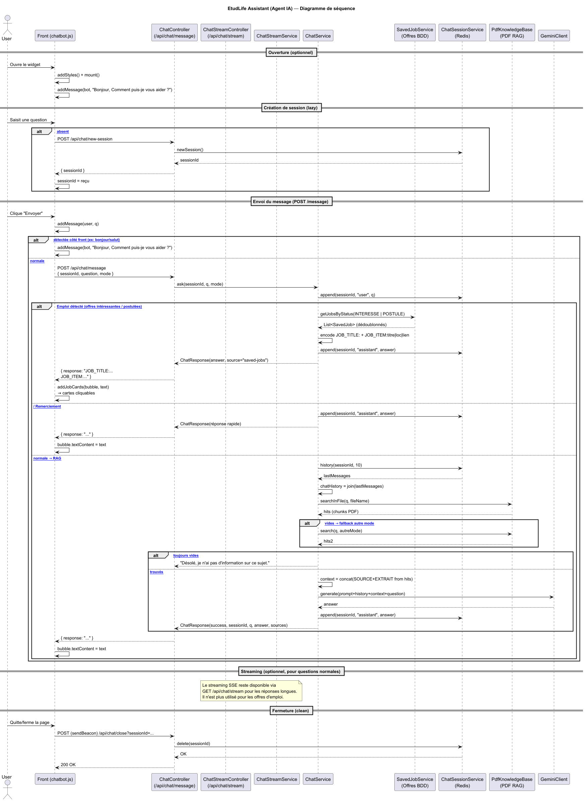

<div align="center">

# Dossier Technique & Manuel Utilisateur

## Projet DevOps - Application EtudLife

**Verson :** v1.0.0

**Auteurs :**

* Lyna Baouche
* Alicya-Pearl Marras
* Kenza Menad
* Dyhia Sellah

**Date :** 02 Février 2026

</div>

---

---

## 📑 Sommaire

**1. Architecture Technique**

* [3.1 Stack Technologique](#31-stack-technologique)
* [3.2 Modélisation (UML) & Structure des Données](#32-modélisation-uml--structure-des-données)

**2. Fonctionnalités Détaillées (User Guide)**

**4. [Tests effectués](#6-tests-effectués)**

**5. [Guide d'Installation & Déploiement](#7-guide-dinstallation--déploiement)**

---

## 1. Architecture Technique

## 2. Fonctionnalités Détaillées 


2.1 Chasseur d'offres de stages Feature
---------------------------------------
* La fonctionnalité Chasseur de Stages transforme l'application en un agent proactif pour l'étudiant. Au lieu d'une recherche manuelle répétitive, le système automatise la veille technologique.
* Les étudiants définissent leurs critères de recherche (secteur, localisation, durée, type de stage) une seule fois, et le système s'occupe du reste.


2.1 Agent IA EtudLife
---------------------------------------
* L’Agent IA EtudLife est conçu comme un assistant conversationnel spécialisé, capable de répondre uniquement à partir des informations contenues dans des documents PDF officiels (règlements, chartes, documents universitaires).
* L’agent ne répond jamais hors périmètre documentaire.
* Les réponses sont générées à partir :
    - d’une recherche d’extraits pertinents dans les PDF (RAG),
    - puis d’un appel à l’API Gemini avec un prompt strict.
* Les réponses sont transmises en streaming au frontend pour une meilleure expérience utilisateur.
  
## 7. Guide d'Installation & Déploiement

### Prérequis

* Java 17 ou 21 installé.
* Accès Internet pour les dépendances Gradle.

### Commandes de lancement

```bash
./gradlew bootRun
```
