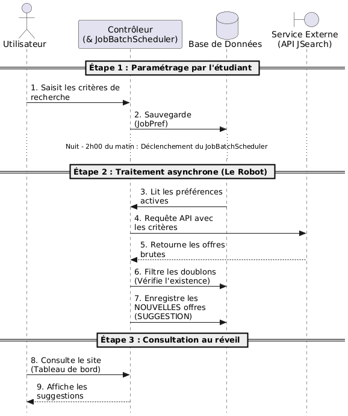
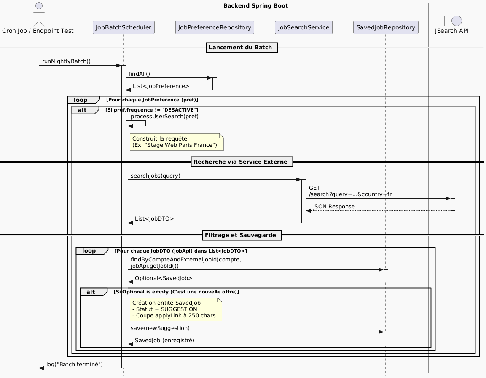

<div align="center">

# Dossier Technique & Manuel Utilisateur

## Projet DevOps - Application EtudLife

**Verson :** v1.0.0

**Auteurs :**

* Lyna Baouche
* Alicya-Pearl Marras
* Kenza Menad
* Dyhia Sellah

**Date :** 02 Février 2026

</div>

---

---

## 📑 Sommaire

**1. Architecture Technique**

* [3.1 Stack Technologique](#31-stack-technologique)
* [3.2 Modélisation (UML) & Structure des Données](#32-modélisation-uml--structure-des-données)

**2. Fonctionnalités Détaillées (User Guide)**

**4. [Tests effectués](#6-tests-effectués)**

**5. [Guide d'Installation & Déploiement](#7-guide-dinstallation--déploiement)**

---

## 1. Architecture Technique

## 2. Fonctionnalités Détaillées 

2.1 Chasseur d'offres de stages Feature
---------------------------------------
### 2.1.1 Recherche d'offres et suivi des candidatures

**Fonctionnalités clés :**
* **Recherche intelligente :** L'utilisateur peut rechercher des offres de stages par mots-clés et localisation. Le backend sécurise la requête en forçant la localisation "France" pour garantir la pertinence des résultats.
* **Gestion des candidatures (ATS) :** L'étudiant peut sauvegarder une offre (statut `INTERESSE`), marquer qu'il a candidaté (statut `POSTULE`), ou masquer une offre non pertinente (statut `REFUSE`).
* **Tableau de bord (KPIs) :** Une page dédiée "Mes candidatures" permet de visualiser les offres sauvegardées, de les filtrer par statut, et d'afficher des indicateurs clés (KPIs) en temps réel (ex: nombre d'offres postulées).
* **Sécurisation des données :** Le système gère dynamiquement la taille des URLs provenant des plateformes externes (LinkedIn, Indeed) pour éviter les erreurs de base de données (Data Truncation).

**Classes Impliquées :**
* `JobController` : Expose les endpoints REST pour la recherche, la sauvegarde et les statistiques.
* `JobSearchService` : Gère la communication HTTP avec l'API externe JSearch.
* `SavedJobService` : Contient la logique métier d'insertion, de mise à jour des statuts et de sécurisation des données.


### 2.1.2 Système de Batch Automatisé pour la recherche d'offres
L'idée est simple : on ne veut pas que nos utilisateurs s'épuisent à faire la même recherche tous les jours. L'étudiant enregistre ses critères (ex: "Stage Web à Paris"), et c'est notre serveur qui bosse pour lui la nuit. Le lendemain, il découvre ses nouvelles Suggestions directement sur son tableau de bord.

Par conséquent, nous avons mis en place un job batch automatisé pour exécuter la recherche d'offres de stages chaque nuit à 2h du matin. Ce job utilise le même service `JobSearchService` que les requêtes utilisateur, garantissant ainsi une cohérence totale entre les résultats affichés et ceux récupérés automatiquement.

**Logique Métier**



**Implémentation technique**



L'architecture est découpée proprement pour séparer les responsabilités :
  * `JobPreference` & `JobPreferenceController` : L'entité qui mémorise ce que cherche l'étudiant (mots-clés, ville) et à quelle fréquence. Le contrôleur s'assure qu'on met à jour ces préférences au lieu de créer des doublons inutiles en base.
  * `JobBatchScheduler` : C'est le chef d'orchestre annoté avec @Scheduled. Il boucle sur toutes les préférences actives, prépare les requêtes et filtre les résultats pour ne garder que le neuf.
  * `JobSearchService` : Le composant d'intégration externe. Il possède une responsabilité unique : interroger l'API distante JSearch et formater les données brutes reçues en une liste structurée et exploitable d'offres d'emploi.
  * `SavedJob` & `JobStatus` : Les offres trouvées par le batch atterrissent ici avec le statut spécial SUGGESTION. Petite astuce technique implémentée : on tronque les URL trop longues (applyLink) à 250 caractères pour éviter que la base de données ne plante lors de l'insertion.

**Déploiement Cloud Conteneurisé et Planification Externe**

Afin de garantir l'exécution asynchrone du traitement par lots (Batch) dans un environnement Cloud, nous avons conteneurisé notre backend (via **Docker**) et l'avons déployé sur la plateforme **Render**. Cependant, les instances de ce type de service sont sujettes à des mises en veille automatiques (Sleep Mode) après une période d'inactivité.
Pour pallier cette contrainte et ne pas dépendre exclusivement du planificateur interne de Spring Boot (@Scheduled), qui s'arrêterait en cas de veille du conteneur, nous avons opté pour une architecture pilotée par des événements externes. 

L'approche technique s'articule autour de deux axes :
  * Exposition d'un Webhook sur le Conteneur : La logique de déclenchement du Batch a été encapsulée et exposée via une route HTTP spécifique (ex: `/api/test/batch/run`). Cela permet de rendre notre traitement interne accessible et exécutable à la demande, depuis l'extérieur du conteneur.
  * Orchestration via un Cron Externe : L'ordonnancement temporel a été délégué à un service tiers spécialisé (tel que **cron-job.org**). Ce dernier est configuré pour émettre une requête HTTP automatisée (un "ping") vers l'endpoint de notre conteneur à une heure fixe (ex: 2h00 du matin).


Résultat : Ce découplage entre la logique métier (embarquée dans le conteneur Spring Boot) et la planification (gérée par le Cron externe) assure une haute résilience. La requête HTTP réveille automatiquement notre conteneur déployé sur Render s'il était inactif, et déclenche le processus d'extraction. Les données sont ainsi systématiquement mises à jour et disponibles pour les étudiants dès leur connexion le lendemain matin.

---------------------------------------

2.2 Agent IA EtudLife
---------------------------------------

* L’Agent IA EtudLife transforme l’application en assistant intelligent contextuel pour les étudiants.

* Il repose sur une architecture RAG (Retrieval Augmented Generation).

* Il conserve l’historique des conversations via Redis.

* Il utilise une API externe d’intelligence artificielle fournie par Google (Gemini).

* Il supporte le streaming temps réel via Server-Sent Events (SSE).

### Règles Métiers

* **Gestion des sessions** : chaque conversation possède un identifiant unique et expire après 30 minutes d’inactivité.

* **Détection d’intentions simples** : les salutations et remerciements sont traités immédiatement pour fournir une réponse rapide.

* **Modes de question** : les questions sont classées en AUTO, SITE ou REGLEMENT selon leur nature.

* **RAG documentaire** : le chatbot répond uniquement à partir des documents disponibles, garantissant des réponses fiables et contextualisées.

* **Streaming interactif** : les réponses longues peuvent être envoyées progressivement pour améliorer l’expérience utilisateur.

* **Intégration des offres d'emploi** : le chatbot détecte les intentions liées aux offres sauvegardées et retourne directement les données depuis la base sans passer par Gemini ni le RAG.
* **Détection d'intentions emploi** : les questions contenant des mots-clés liés aux offres ("liste mes offres", "mes candidatures", "j'ai postulé", etc.) sont interceptées avant le RAG et traitées via le service dédié.
* **Statuts gérés** : INTERESSE (offres marquées intéressantes) et POSTULE (offres pour lesquelles l'étudiant a postulé).
* **Dédoublonnage** : les offres sont dédoublonnées par externalJobId avant d'être retournées.
* **Format de réponse structuré** : les offres sont encodées au format JOB_TITLE: / JOB_ITEM:titre|localisation|lien pour permettre un rendu en cartes cliquables côté frontend.


Dans "Classes Impliquées", ajoute :

SavedJobService — récupération et dédoublonnage des offres sauvegardées par statut pour un compte donné.
JobSearchService — appel à l'API externe JSearch (RapidAPI) pour la recherche d'offres LinkedIn/Indeed.
SavedJob — entité représentant une offre sauvegardée avec son statut (INTERESSE, POSTULE, REFUSE, SUGGESTION).


Dans "Algorithme & Logique Backend", ajoute un paragraphe :
Avant d'effectuer la recherche RAG, le système vérifie si la question correspond à une intention liée aux offres d'emploi sauvegardées. Si c'est le cas, les offres sont récupérées depuis la base de données selon leur statut (INTERESSE ou POSTULE), dédoublonnées par identifiant externe, puis encodées dans un format structuré (JOB_ITEM). Ce format est interprété par le frontend pour afficher des cartes cliquables avec titre, localisation et lien de candidature, sans aucun appel à Gemini. Sonnet 4.6

### Classes Impliquées
* `ChatController` endpoints REST pour créer une session, envoyer un message, consulter l’historique et fermer une session.

* `ChatStreamController` endpoint REST pour le streaming des réponses en temps réel.

* `ChatService` logique métier principale, traitement des questions et génération des réponses.

* `ChatSessionService` gestion des sessions et de l’historique conversationnel.

* `ChatStreamService` gestion du découpage et de l’envoi progressif des réponses pour le streaming.

* `GeminiClient` appel à l’API externe Gemini pour générer les réponses.

* `PdfKnowledgeBase` recherche des extraits pertinents dans la base documentaire.

* `SavedJobService`  récupération et dédoublonnage des offres sauvegardées par statut pour un compte donné.

* `JobSearchService` appel à l'API externe JSearch (RapidAPI) pour la recherche d'offres LinkedIn/Indeed.

* `SavedJob` entité représentant une offre sauvegardée avec son statut (INTERESSE, POSTULE, REFUSE, SUGGESTION).
### Algorithme & Logique Backend :

Le chatbot expose plusieurs endpoints REST permettant de créer une session, envoyer un message, consulter l’historique, fermer une session ou activer le streaming temps réel.

Lorsqu’un message est reçu, les données sont validées. Si nécessaire, une nouvelle session est générée et stockée dans Redis avec un TTL de 30 minutes. Le message est ensuite enregistré afin de conserver l’historique conversationnel.

Le système intercepte d’abord certaines intentions simples (salutations, remerciements) pour éviter un appel inutile à l’API externe. Le mode de fonctionnement (AUTO, SITE, REGLEMENT) est ensuite déterminé, puis une recherche est effectuée dans la base documentaire via le mécanisme RAG.

Si aucun contenu pertinent n’est trouvé, une réponse standardisée est renvoyée afin d’éviter toute hallucination. Sinon, un prompt structuré est construit et envoyé à l’API Gemini. La réponse générée est sauvegardée dans Redis puis retournée au frontend avec les sources associées.

En mode streaming, la réponse est découpée et envoyée progressivement via SSE afin d’améliorer l’expérience utilisateur.

Avant d'effectuer la recherche RAG, le système vérifie si la question correspond à une intention liée aux offres d'emploi sauvegardées. Si c'est le cas, les offres sont récupérées depuis la base de données selon leur statut (INTERESSE ou POSTULE), dédoublonnées par identifiant externe, puis encodées dans un format structuré (JOB_ITEM). Ce format est interprété par le frontend pour afficher des cartes cliquables avec titre, localisation et lien de candidature, sans aucun appel à Gemini.


---------------------------------------
# **4. Tests effectués**
### 4.1 Tests du module "Chasseur de Stages"
#### 4.1.1 Recherche de stages (JobSearch)

Pour garantir la fiabilité de la recherche et de la sauvegarde des offres de stages, nous avons mis en place une couverture de tests hybride (Unitaires et Intégration) via **JUnit 5** et **Mockito**. Cette couverture est automatisée via une pipeline CI (GitHub Actions).

* **Tests Unitaires (Business Logic) :**
    * `SavedJobServiceTest` : Validation des règles de gestion critiques et de la sécurisation des données. Le test vérifie notamment que les URLs d'offres excessivement longues provenant d'API externes sont correctement tronquées à 250 caractères maximum avant l'insertion en base, prévenant ainsi les erreurs critiques de type 500 (`DataTruncationException`).
    * `JobSearchServiceTest` : Validation de la résilience du système. Nous testons le comportement de l'application en cas de défaillance de l'API externe (JSearch down ou timeout) pour s'assurer que l'application ne crashe pas et retourne un état propre (liste vide).

* **Tests d'Intégration (API & Contrôleurs) :**
    * `JobControllerIntegrationTest` : Utilisation de `@WebMvcTest` et `MockMvc` pour valider les endpoints REST.
    * **Forçage Géographique :** Vérification que le contrôleur intercepte la requête utilisateur et ajoute automatiquement la chaîne `"France"` pour éviter les résultats hors-périmètre (ex: offres aux USA).
    * **Calcul des KPIs :** Validation de la route `/api/jobs/stats` qui filtre le pipeline de données en base de données pour retourner le décompte exact des offres statuées (`INTERESSE`, `POSTULE`, `REFUSE`), garantissant l'exactitude du Dashboard utilisateur.

#### 4.1.2 Système de Batch Automatisé
Afin de garantir la fiabilité du processus automatisé et d'optimiser l'utilisation de nos quotas d'API, nous avons mis en place une stratégie de validation rigoureuse reposant sur trois niveaux de tests :

* **Test du Contrôleur (`JobPreferenceControllerTest`) :**
  * Utilisation de Mockito pour simuler la base de données.
  * Vérification stricte : si l'étudiant a déjà une alerte, on écrase l'ancienne au lieu d'en recréer une nouvelle (conservation de l'ID).

* **Test Unitaire du Scheduler (`JobBatchSchedulerTest`) :**
  * On isole complètement la logique du batch.
  * On vérifie que la boucle tourne bien sur toutes les préférences et appelle le service de recherche avec les bons paramètres, sans jamais faire de vraie requête HTTP.
  
* **Test d'Intégration Complet (`BatchIntegrationTest`) :**
  * Le test ultime avec @SpringBootTest et une base de données en mémoire (H2).
  * On simule un compte, on simule une fausse réponse de l'API ("Stage Java"), on lance le Batch manuellement, et on vérifie que la base de données contient bien exactement une nouvelle ligne avec le statut SUGGESTION.

  
---------------------------------------
## 5. Guide d'Installation & Déploiement

### Prérequis

* **Docker et Docker Compose** installés sur la machine cible (recommandé pour l'architecture DevOps complète).
* **Java 17 ou 21** (si exécution en local sans Docker).
* Un fichier `.env` contenant les clés d'API nécessaires (`RAPIDAPI_KEY`, `DB_PASSWORD`, etc.).

### Commandes de lancement (Docker - Recommandé)

Pour lancer l'infrastructure complète (Base de données + Backend Spring Boot + Frontend Nginx) :

```bash
# 1. Cloner le projet et se rendre à la racine
git clone [https://github.com/LynaBaouche/DevOps.git](https://github.com/LynaBaouche/DevOps.git)
cd DevOps

# 2. Lancer les conteneurs en tâche de fond
docker-compose up --build -d

# 3. Vérifier les logs du backend
docker logs -f backend
