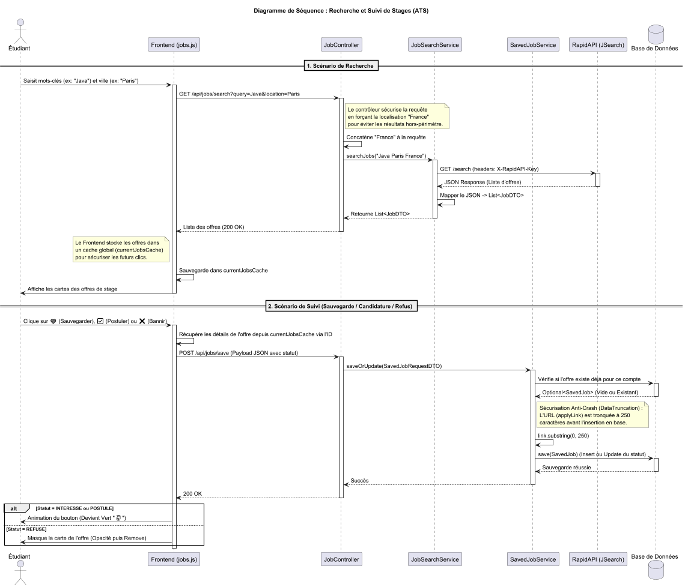
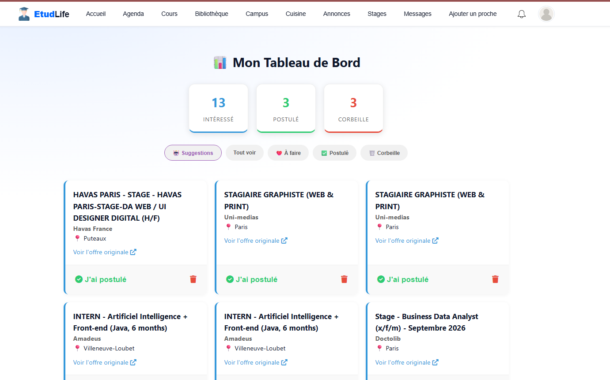
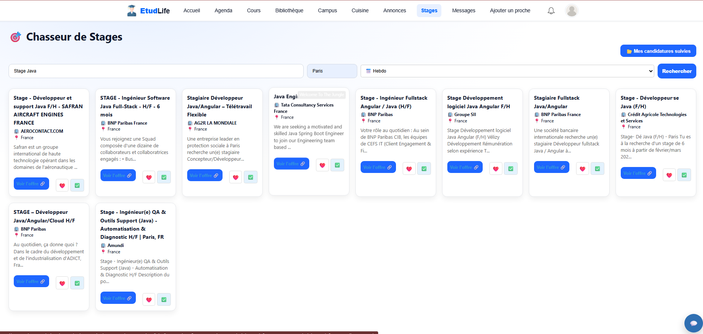
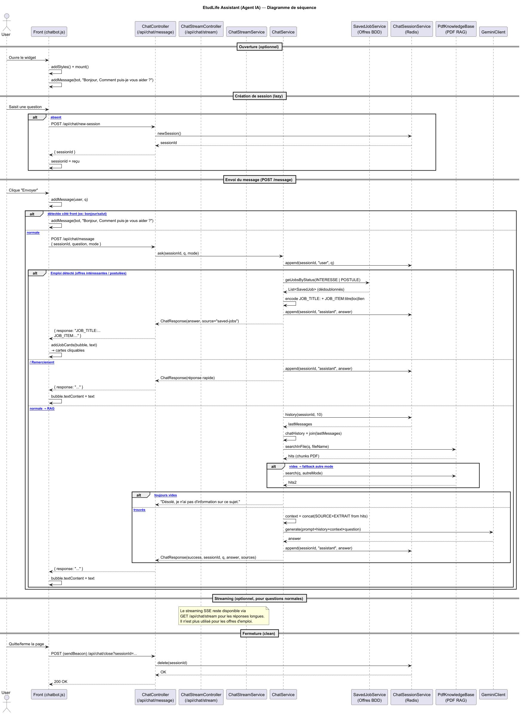
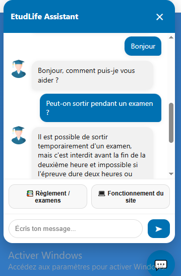
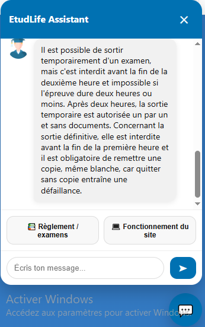

<div align="center">

# Dossier Technique & Manuel Utilisateur

## Projet DevOps - Application EtudLife

**Verson :** v1.0.0

**Auteurs :**

* Lyna Baouche
* Alicya-Pearl Marras
* Kenza Menad
* Dyhia Sellah

**Date :** 02 Février 2026

</div>

---

---

## 📑 Sommaire

**1. Architecture Technique**

* [3.1 Stack Technologique](#31-stack-technologique)
* [3.2 Modélisation (UML) & Structure des Données](#32-modélisation-uml--structure-des-données)

**2. Fonctionnalités Détaillées (User Guide)**

**4. [Tests effectués](#6-tests-effectués)**

**5. [Guide d'Installation & Déploiement](#7-guide-dinstallation--déploiement)**

---

## 1. Architecture Technique

## 2. Fonctionnalités Détaillées 


2.1 Chasseur d'offres de stages Feature
---------------------------------------
**Fonctionnalités clés :**
* **Recherche intelligente :** L'utilisateur peut rechercher des offres de stages par mots-clés et localisation. Le backend sécurise la requête en forçant la localisation "France" pour garantir la pertinence des résultats.
* **Gestion des candidatures (ATS) :** L'étudiant peut sauvegarder une offre (statut `INTERESSE`), marquer qu'il a candidaté (statut `POSTULE`), ou masquer une offre non pertinente (statut `REFUSE`).
* **Tableau de bord (KPIs) :** Une page dédiée "Mes candidatures" permet de visualiser les offres sauvegardées, de les filtrer par statut, et d'afficher des indicateurs clés (KPIs) en temps réel (ex: nombre d'offres postulées).
* **Sécurisation des données :** Le système gère dynamiquement la taille des URLs provenant des plateformes externes (LinkedIn, Indeed) pour éviter les erreurs de base de données (Data Truncation).

**Classes Impliquées :**
* `JobController` : Expose les endpoints REST pour la recherche, la sauvegarde et les statistiques.
* `JobSearchService` : Gère la communication HTTP avec l'API externe JSearch.
* `SavedJobService` : Contient la logique métier d'insertion, de mise à jour des statuts et de sécurisation des données.







**Partie Batch ( Alicya) :**

---------------------------------------

2.2 Agent IA EtudLife
---------------------------------------

* L’Agent IA EtudLife transforme l’application en assistant intelligent contextuel pour les étudiants.

* Il repose sur une architecture RAG (Retrieval Augmented Generation).

* Il conserve l’historique des conversations via Redis.

* Il utilise une API externe d’intelligence artificielle fournie par Google (Gemini).

* Il supporte le streaming temps réel via Server-Sent Events (SSE).

### Règles Métiers

* **Gestion des sessions** : chaque conversation possède un identifiant unique et expire après 30 minutes d’inactivité.

* **Détection d’intentions simples** : les salutations et remerciements sont traités immédiatement pour fournir une réponse rapide.

* **Modes de question** : les questions sont classées en AUTO, SITE ou REGLEMENT selon leur nature.

* **RAG documentaire** : le chatbot répond uniquement à partir des documents disponibles, garantissant des réponses fiables et contextualisées.

* **Streaming interactif** : les réponses longues peuvent être envoyées progressivement pour améliorer l’expérience utilisateur.

### Classes Impliquées
* `ChatController` endpoints REST pour créer une session, envoyer un message, consulter l’historique et fermer une session.

* `ChatStreamController` endpoint REST pour le streaming des réponses en temps réel.

* `ChatService` logique métier principale, traitement des questions et génération des réponses.

* `ChatSessionService` gestion des sessions et de l’historique conversationnel.

* `ChatStreamService` gestion du découpage et de l’envoi progressif des réponses pour le streaming.

* `GeminiClient` appel à l’API externe Gemini pour générer les réponses.

* `PdfKnowledgeBase` recherche des extraits pertinents dans la base documentaire.
### Algorithme & Logique Backend :

Le chatbot expose plusieurs endpoints REST permettant de créer une session, envoyer un message, consulter l’historique, fermer une session ou activer le streaming temps réel.

Lorsqu’un message est reçu, les données sont validées. Si nécessaire, une nouvelle session est générée et stockée dans Redis avec un TTL de 30 minutes. Le message est ensuite enregistré afin de conserver l’historique conversationnel.

Le système intercepte d’abord certaines intentions simples (salutations, remerciements) pour éviter un appel inutile à l’API externe. Le mode de fonctionnement (AUTO, SITE, REGLEMENT) est ensuite déterminé, puis une recherche est effectuée dans la base documentaire via le mécanisme RAG.

Si aucun contenu pertinent n’est trouvé, une réponse standardisée est renvoyée afin d’éviter toute hallucination. Sinon, un prompt structuré est construit et envoyé à l’API Gemini. La réponse générée est sauvegardée dans Redis puis retournée au frontend avec les sources associées.

En mode streaming, la réponse est découpée et envoyée progressivement via SSE afin d’améliorer l’expérience utilisateur.





---------------------------------------
# **4. Tests effectués**
### 4.1 Tests du module "Chasseur de Stages" (JobSearch)

Pour garantir la fiabilité de la recherche et de la sauvegarde des offres de stages, nous avons mis en place une couverture de tests hybride (Unitaires et Intégration) via **JUnit 5** et **Mockito**. Cette couverture est automatisée via une pipeline CI (GitHub Actions).

* **Tests Unitaires (Business Logic) :**
    * `SavedJobServiceTest` : Validation des règles de gestion critiques et de la sécurisation des données. Le test vérifie notamment que les URLs d'offres excessivement longues provenant d'API externes sont correctement tronquées à 250 caractères maximum avant l'insertion en base, prévenant ainsi les erreurs critiques de type 500 (`DataTruncationException`).
    * `JobSearchServiceTest` : Validation de la résilience du système. Nous testons le comportement de l'application en cas de défaillance de l'API externe (JSearch down ou timeout) pour s'assurer que l'application ne crashe pas et retourne un état propre (liste vide).

* **Tests d'Intégration (API & Contrôleurs) :**
    * `JobControllerIntegrationTest` : Utilisation de `@WebMvcTest` et `MockMvc` pour valider les endpoints REST.
    * **Forçage Géographique :** Vérification que le contrôleur intercepte la requête utilisateur et ajoute automatiquement la chaîne `"France"` pour éviter les résultats hors-périmètre (ex: offres aux USA).
    * **Calcul des KPIs :** Validation de la route `/api/jobs/stats` qui filtre le pipeline de données en base de données pour retourner le décompte exact des offres statuées (`INTERESSE`, `POSTULE`, `REFUSE`), garantissant l'exactitude du Dashboard utilisateur.
---------------------------------------
## 5. Guide d'Installation & Déploiement

### Prérequis

* **Docker et Docker Compose** installés sur la machine cible (recommandé pour l'architecture DevOps complète).
* **Java 17 ou 21** (si exécution en local sans Docker).
* Un fichier `.env` contenant les clés d'API nécessaires (`RAPIDAPI_KEY`, `DB_PASSWORD`, etc.).

### Commandes de lancement (Docker - Recommandé)

Pour lancer l'infrastructure complète (Base de données + Backend Spring Boot + Frontend Nginx) :

```bash
# 1. Cloner le projet et se rendre à la racine
git clone [https://github.com/LynaBaouche/DevOps.git](https://github.com/LynaBaouche/DevOps.git)
cd DevOps

# 2. Lancer les conteneurs en tâche de fond
docker-compose up --build -d

# 3. Vérifier les logs du backend
docker logs -f backend
